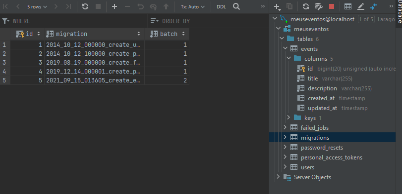

# Laravel Mastery - CodeExperts

https://codeexperts.com.br/curso/laravel-mastery

## <a name="indice">Índice</a>

1. [Boas Vindas](#parte1)
2. [Ambiente](#parte2)
3. [Primeiros Passos Visão Geral](#parte3)
4. [Migrations, Seeders e Factories](#parte4)
5. [Eloquent](#parte5)
6. [Factories com Relacionamentos](#parte6)
7. [View: Laravel Blade](#parte7)
8. [View: Manipulação de Formulários](#parte8)
9. [Laravel Router](#parte9)
10. [Manipulando Validações](#parte10)
11. [Controllers como Recurso](#parte11)
12. [Primeiro Starter Point: Laravel UI](#parte12)
13. [Melhorias Projeto Eventos](#parte13)
14. [Upload de Arquivos](#parte14)
15. [Melhorias & Encerramento Bloco 1](#parte15)
16. [ACL & Autorização](#parte16)
17. [Bloco 2 - Iniciando](#parte17)
18. [Primeiros Passos com Livewire](#parte18)
---


## <a name="parte1">1 - Boas Vindas</a>

01 - Seja Bem-Vindo

02 - Quem Sou Eu

03 - Ferramentas

- PHP Storm Para estudantes, solicite em https://www.jetbrains.com/student/

- Para open source, caso você contribua, solicite em https://www.jetbrains.com/community/opensource/

- Visual Studio Code: https://code.visualstudio.com/

[Voltar ao Índice](#indice)

---


## <a name="parte2">2 - Ambiente</a>

**04 - Formas de Iniciar Projeto**

- php 7.3+

```
$ php -m
[PHP Modules]
bcmath
ctype
fileinfo
json
mbstring
openssl
PDO
tokenizer
xml

```

05 - Laravel Installer OS X

06 - Laravel Installer Linux

**07 - Laravel Installer Windows**

```
$ composer global require laravel/installer

add PATH Composer e /laravel/bin/

laravel new projeto01

php artisan serve
```

[Voltar ao Índice](#indice)

---


## <a name="parte3">3 - Primeiros Passos Visão Geral</a>

**08 - Iniciando Projeto**

- [3-Primeiros-Passos-Visao-Geral/meusEventos](3-Primeiros-Passos-Visao-Geral/meusEventos)

**09 - Diretórios Projeto**

**10 - Panorama Inicial do Laravel**

- [3-Primeiros-Passos-Visao-Geral/meusEventos/resources/views/ola-mundo.blade.php](3-Primeiros-Passos-Visao-Geral/meusEventos/resources/views/ola-mundo.blade.php)

- [3-Primeiros-Passos-Visao-Geral/meusEventos/routes/web.php](3-Primeiros-Passos-Visao-Geral/meusEventos/routes/web.php)

```php

Route::get('/', function () {
    return view('welcome');
});

/*Route::get('/ola-mundo', function () {
    return "Olá Mundo!!";
});*/
Route::get('/ola-mundo', function () {
    return view('ola-mundo');
});

//Verbos HTTP: GET, POST, PUT, PATCH, DELETE e Options

```

**11 - Parâmetros Dinâmicos Rota**

- [3-Primeiros-Passos-Visao-Geral/meusEventos/routes/web.php](3-Primeiros-Passos-Visao-Geral/meusEventos/routes/web.php)

```php
Route::get('/hello/{name}', function ($name = null) {
    return 'Olá, ' . $name;
});

```

**12 - Rotas & Controllers**

```
php artisan make:controller HelloWordController

```

```php
Route::get('/hello-world', [\App\Http\Controllers\HelloWordController::class, 'helloWord']);

//Verbos HTTP: GET, POST, PUT, PATCH, DELETE e Options

Route::get('/hello/{name?}',  [\App\Http\Controllers\HelloWordController::class, 'hello']);

```

- [3-Primeiros-Passos-Visao-Geral/meusEventos/app/Http/Controllers/HelloWordController.php](3-Primeiros-Passos-Visao-Geral/meusEventos/app/Http/Controllers/HelloWordController.php)

```php
class HelloWordController extends Controller
{
    public function helloWord()
    {
        return view('ola-mundo');
    }

    public function hello($name = 'Fulano')
    {
        return 'Olá, ' . $name;
    }
}
```

**13 - O Artisan**

```
$ php artisan list
Laravel Framework 8.61.0

Usage:
  command [options] [arguments]

Options:
  -h, --help            Display help for the given command. When no command is given display help for the list command
  -q, --quiet           Do not output any message
  -V, --version         Display this application version
      --ansi|--no-ansi  Force (or disable --no-ansi) ANSI output
  -n, --no-interaction  Do not ask any interactive question
      --env[=ENV]       The environment the command should run under
  -v|vv|vvv, --verbose  Increase the verbosity of messages: 1 for normal output, 2 for more verbose output and 3 for debug

Available commands:
  clear-compiled       Remove the compiled class file
  db                   Start a new database CLI session
  down                 Put the application into maintenance / demo mode
  env                  Display the current framework environment
  help                 Display help for a command
  inspire              Display an inspiring quote
  list                 List commands
  migrate              Run the database migrations
  optimize             Cache the framework bootstrap files
  serve                Serve the application on the PHP development server
  test                 Run the application tests
  tinker               Interact with your application
  up                   Bring the application out of maintenance mode
 auth
  auth:clear-resets    Flush expired password reset tokens
 cache
  cache:clear          Flush the application cache
  cache:forget         Remove an item from the cache
  cache:table          Create a migration for the cache database table
 config
  config:cache         Create a cache file for faster configuration loading
  config:clear         Remove the configuration cache file
 db
  db:seed              Seed the database with records
  db:wipe              Drop all tables, views, and types
 event
  event:cache          Discover and cache the application's events and listeners
  event:clear          Clear all cached events and listeners
  event:generate       Generate the missing events and listeners based on registration
  event:list           List the application's events and listeners
 key
  key:generate         Set the application key
 make
  make:cast            Create a new custom Eloquent cast class
  make:channel         Create a new channel class
  make:command         Create a new Artisan command
  make:component       Create a new view component class
  make:controller      Create a new controller class
  make:event           Create a new event class
  make:exception       Create a new custom exception class
  make:factory         Create a new model factory
  make:job             Create a new job class
  make:listener        Create a new event listener class
  make:mail            Create a new email class
  make:middleware      Create a new middleware class
  make:migration       Create a new migration file
  make:model           Create a new Eloquent model class
  make:notification    Create a new notification class
  make:observer        Create a new observer class
  make:policy          Create a new policy class
  make:provider        Create a new service provider class
  make:request         Create a new form request class
  make:resource        Create a new resource
  make:rule            Create a new validation rule
  make:seeder          Create a new seeder class
  make:test            Create a new test class
 migrate
  migrate:fresh        Drop all tables and re-run all migrations
  migrate:install      Create the migration repository
  migrate:refresh      Reset and re-run all migrations
  migrate:reset        Rollback all database migrations
  migrate:rollback     Rollback the last database migration
  migrate:status       Show the status of each migration
 model
  model:prune          Prune models that are no longer needed
 notifications
  notifications:table  Create a migration for the notifications table
 optimize
  optimize:clear       Remove the cached bootstrap files
 package
  package:discover     Rebuild the cached package manifest
 queue
  queue:batches-table  Create a migration for the batches database table
  queue:clear          Delete all of the jobs from the specified queue
  queue:failed         List all of the failed queue jobs
  queue:failed-table   Create a migration for the failed queue jobs database table
  queue:flush          Flush all of the failed queue jobs
  queue:forget         Delete a failed queue job
  queue:listen         Listen to a given queue
  queue:monitor        Monitor the size of the specified queues
  queue:prune-batches  Prune stale entries from the batches database
  queue:prune-failed   Prune stale entries from the failed jobs table
  queue:restart        Restart queue worker daemons after their current job
  queue:retry          Retry a failed queue job
  queue:retry-batch    Retry the failed jobs for a batch
  queue:table          Create a migration for the queue jobs database table
  queue:work           Start processing jobs on the queue as a daemon
 route
  route:cache          Create a route cache file for faster route registration
  route:clear          Remove the route cache file
  route:list           List all registered routes
 sail
  sail:install         Install Laravel Sail's default Docker Compose file
  sail:publish         Publish the Laravel Sail Docker files
 schedule
  schedule:list        List the scheduled commands
  schedule:run         Run the scheduled commands
  schedule:test        Run a scheduled command
  schedule:work        Start the schedule worker
 schema
  schema:dump          Dump the given database schema
 session
  session:table        Create a migration for the session database table
 storage
  storage:link         Create the symbolic links configured for the application
 stub
  stub:publish         Publish all stubs that are available for customization
 vendor
  vendor:publish       Publish any publishable assets from vendor packages
 view
  view:cache           Compile all of the application's Blade templates
  view:clear           Clear all compiled view files

```

```
$ php artisan make:controller --help
Description:
  Create a new controller class

Usage:
  make:controller [options] [--] <name>

Arguments:
  name                   The name of the class

Options:
      --api              Exclude the create and edit methods from the controller.
      --type=TYPE        Manually specify the controller stub file to use.
      --force            Create the class even if the controller already exists
  -i, --invokable        Generate a single method, invokable controller class.
  -m, --model[=MODEL]    Generate a resource controller for the given model.
  -p, --parent[=PARENT]  Generate a nested resource controller class.
  -r, --resource         Generate a resource controller class.
  -h, --help             Display help for the given command. When no command is given display help for the list command
  -q, --quiet            Do not output any message
  -V, --version          Display this application version
      --ansi|--no-ansi   Force (or disable --no-ansi) ANSI output
  -n, --no-interaction   Do not ask any interactive question
      --env[=ENV]        The environment the command should run under
  -v|vv|vvv, --verbose   Increase the verbosity of messages: 1 for normal output, 2 for more verbose output and 3 for debug


```

**14 - Entendendo as Configurações**

- [3-Primeiros-Passos-Visao-Geral/meusEventos/.env](3-Primeiros-Passos-Visao-Geral/meusEventos/.env)

- [3-Primeiros-Passos-Visao-Geral/meusEventos/config/database.php](3-Primeiros-Passos-Visao-Geral/meusEventos/config/database.php)


**15 - Migrations**

- [3-Primeiros-Passos-Visao-Geral/meusEventos/database/migrations/2014_10_12_000000_create_users_table.php](3-Primeiros-Passos-Visao-Geral/meusEventos/database/migrations/2014_10_12_000000_create_users_table.php)

**16 - Executando Migrations**

Comando cria uma tabela no banco de dados, 'meuseventos', chamada 'migrations' 

```
$ php artisan migrate:install
Migration table created successfully.

```

comando para rodar os arquivos de migrates

```
$ php artisan migrate
Migrating: 2014_10_12_000000_create_users_table
Migrated:  2014_10_12_000000_create_users_table (31.36ms)
Migrating: 2014_10_12_100000_create_password_resets_table
Migrated:  2014_10_12_100000_create_password_resets_table (27.77ms)
Migrating: 2019_08_19_000000_create_failed_jobs_table
Migrated:  2019_08_19_000000_create_failed_jobs_table (26.90ms)
Migrating: 2019_12_14_000001_create_personal_access_tokens_table
Migrated:  2019_12_14_000001_create_personal_access_tokens_table (36.64ms)
```


**17 - Criando Primeira Migração**

```
$ php artisan make:migration create_events_table
Created Migration: 2021_09_15_013605_create_events_table

```

- [3-Primeiros-Passos-Visao-Geral/meusEventos/database/migrations/2021_09_15_013605_create_events_table.php](3-Primeiros-Passos-Visao-Geral/meusEventos/database/migrations/2021_09_15_013605_create_events_table.php)

```php
  public function up()
    {
        Schema::create('events', function (Blueprint $table) {
            $table->id();
            $table->string('title');
            $table->string('description');
            $table->timestamps();
        });
    }
```

```
$ php artisan migrate
Migrating: 2021_09_15_013605_create_events_table
Migrated:  2021_09_15_013605_create_events_table (24.80ms)

```




18 - Os Models

```
$ php artisan make:model Event
Model created successfully.

```

- [3-Primeiros-Passos-Visao-Geral/meusEventos/app/Models/Event.php](3-Primeiros-Passos-Visao-Geral/meusEventos/app/Models/Event.php)

19 - O Eloquent e Queries

- [3-Primeiros-Passos-Visao-Geral/meusEventos/routes/web.php](3-Primeiros-Passos-Visao-Geral/meusEventos/routes/web.php)

```php
Route::get('/queries/{event?}', function ($event){

    //$events = \App\Models\Event::all();// SELECT * FROM events
    $events = \App\Models\Event::all(['title', 'description']);// SELECT * FROM events

    //$event = \App\Models\Event::where('id', 2)->get(); // SELECT * FROM events where id = 2
    //$event = \App\Models\Event::where('id', 2)->first(); // SELECT * FROM events where id = 2
    $event = \App\Models\Event::find($event); // SELECT * FROM events where id = 2

    //return $events;
    return $event;

});
```

20 - O Tinker

```
$ php artisan tinker
Psy Shell v0.10.8 (PHP 7.4.19 — cli) by Justin Hileman

>>> $events = \App\Models\Event::all()

=> Illuminate\Database\Eloquent\Collection {#4184
     all: [
       App\Models\Event {#4186
         id: 2,
         title: "Segundo Evento teste",
         description: "desc evento 2",
         created_at: "2021-09-15 08:46:29",
         updated_at: null,
       },
       App\Models\Event {#4185
         id: 3,
         title: "terceiro evento",
         description: "desc evento 3",
         created_at: "2021-09-15 08:46:53",
         updated_at: null,
       },
     ],
   }
>>>
>>> \App\Models\Event::find(2);

=> App\Models\Event {#4399
     id: 2,
     title: "Segundo Evento teste",
     description: "desc evento 2",
     created_at: "2021-09-15 08:46:29",
     updated_at: null,
   }
>>>

```

21 - Assets Frontend

22 - Conclusões

[Voltar ao Índice](#indice)

---


## <a name="parte4">4 - Migrations, Seeders e Factories</a>


[Voltar ao Índice](#indice)

---


## <a name="parte5">5 - Eloquent</a>


[Voltar ao Índice](#indice)

---


## <a name="parte6">6 - Factories com Relacionamentos</a>


[Voltar ao Índice](#indice)

---


## <a name="parte7">7 - View: Laravel Blade</a>


[Voltar ao Índice](#indice)

---


## <a name="parte8">8 - View: Manipulação de Formulários</a>


[Voltar ao Índice](#indice)

---


## <a name="parte9">9 - Laravel Router</a>


[Voltar ao Índice](#indice)

---


## <a name="parte10">10 - Manipulando Validações</a>


[Voltar ao Índice](#indice)

---


## <a name="parte11">11 - Controllers como Recurso</a>


[Voltar ao Índice](#indice)

---


## <a name="parte12">12 - Primeiro Starter Point: Laravel UI</a>


[Voltar ao Índice](#indice)

---


## <a name="parte13">13 - Melhorias Projeto Eventos</a>


[Voltar ao Índice](#indice)

---


## <a name="parte14">14 - Upload de Arquivos</a>


[Voltar ao Índice](#indice)

---


## <a name="parte15">15 - Melhorias & Encerramento Bloco 1</a>


[Voltar ao Índice](#indice)

---


## <a name="parte16">16 - ACL & Autorização</a>


[Voltar ao Índice](#indice)

---


## <a name="parte17">17 - Bloco 2 - Iniciando</a>


[Voltar ao Índice](#indice)

---


## <a name="parte18">18 - Primeiros Passos com Livewire</a>


[Voltar ao Índice](#indice)

---

