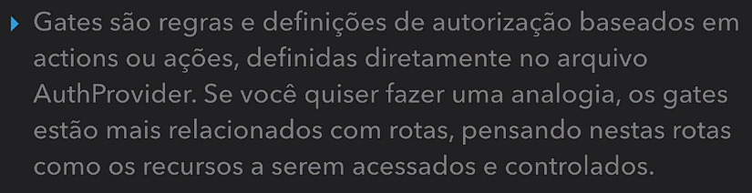
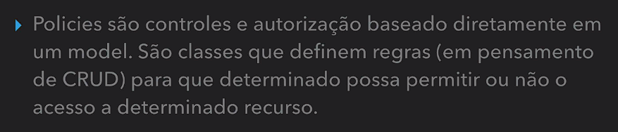

# Laravel Mastery - CodeExperts

https://codeexperts.com.br/curso/laravel-mastery

## <a name="indice">Índice</a>

1. [Boas Vindas](#parte1)
2. [Ambiente](#parte2)
3. [Primeiros Passos Visão Geral](#parte3)
4. [Migrations, Seeders e Factories](#parte4)
5. [Eloquent](#parte5)
6. [Factories com Relacionamentos](#parte6)
7. [View: Laravel Blade](#parte7)
8. [View: Manipulação de Formulários](#parte8)
9. [Laravel Router](#parte9)
10. [Manipulando Validações](#parte10)
11. [Controllers como Recurso](#parte11)
12. [Primeiro Starter Point: Laravel UI](#parte12)
13. [Melhorias Projeto Eventos](#parte13)
14. [Upload de Arquivos](#parte14)
15. [Melhorias & Encerramento Bloco 1](#parte15)
16. [ACL & Autorização](#parte16)
17. [Bloco 2 - Iniciando](#parte17)
18. [Primeiros Passos com Livewire](#parte18)
19. [Conhecendo o Tailwind](#parte19)
20. [Iniciando Projeto de Fato](#parte20)
21. [Upload e Processamento de Video](#parte21)
22. [Trabalhando com Filas](#parte22)
23. [Notificações & Player](#parte23)
24. [Relações Polimórficas & Incrementos Projeto](#parte24)
25. [Assinatura com Laravel Cashier Stripe](#parte25)
26. [Melhorias e Finalizando Bloco 2](#parte26)
27. [Iniciando Bloco 3](#parte27)
28. [Nossa Primeira API REST](#parte28)
29. [Recursos para API](#parte29)
30. [Sanctum: API Tokens Backend](#parte30)
31. [Testes de Software Laravel](#parte31)
32. [Front com VueJS - Autenticação](#parte32)
33. [Gerenciando Estado com Pinia](#parte33)
---


## <a name="parte1">1 - Boas Vindas</a>

01 - Seja Bem-Vindo

02 - Quem Sou Eu

03 - Ferramentas

- PHP Storm Para estudantes, solicite em https://www.jetbrains.com/student/

- Para open source, caso você contribua, solicite em https://www.jetbrains.com/community/opensource/

- Visual Studio Code: https://code.visualstudio.com/

[Voltar ao Índice](#indice)

---


## <a name="parte2">2 - Ambiente</a>

**04 - Formas de Iniciar Projeto**

- php 7.3+

```
$ php -m
[PHP Modules]
bcmath
ctype
fileinfo
json
mbstring
openssl
PDO
tokenizer
xml

```

05 - Laravel Installer OS X

06 - Laravel Installer Linux

**07 - Laravel Installer Windows**

```
$ composer global require laravel/installer

add PATH Composer e /laravel/bin/

laravel new projeto01

php artisan serve
```

[Voltar ao Índice](#indice)

---


## <a name="parte3">3 - Primeiros Passos Visão Geral</a>
 
- 08 - Iniciando Projeto

  - [03-PrimeirosPassosVisaoGeral/proj-meuseventos-03-01](03-PrimeirosPassosVisaoGeral/proj-meuseventos-03-01)
  - [03-PrimeirosPassosVisaoGeral/projMeusEventos](03-PrimeirosPassosVisaoGeral/projMeusEventos)
  - [appMeusEventos](appMeusEventos)
  - [app2meuseventos](app2meuseventos)

- 09 - Diretórios Projeto

IA BING:

Aqui está um resumo das funções de cada pasta na estrutura de pastas do Laravel 10:

- **app**: Contém o código principal do seu aplicativo, incluindo controladores, middleware, solicitações e provedores¹.
- **bootstrap**: Contém o arquivo app.php que inicializa o framework. Este diretório também contém um diretório de cache que contém arquivos gerados pelo framework para otimização de desempenho¹.
- **config**: Como o nome indica, contém todos os arquivos de configuração do seu aplicativo¹.
- **database**: Contém suas migrações de banco de dados, fábricas de modelos e sementes¹.
- **public**: Contém o arquivo index.php, que é o ponto de entrada para todas as solicitações que entram no seu aplicativo e configura a autocarga. Este diretório também contém seus ativos, como imagens, JavaScript e CSS¹.
- **resources**: Contém suas visualizações, bem como seus ativos brutos e não compilados, como CSS ou JavaScript¹.
- **routes**: Contém todas as definições de rota para o seu aplicativo¹.
- **storage**: Contém seus logs, templates Blade compilados, sessões baseadas em arquivos, caches de arquivos e outros arquivos gerados pelo framework. Este diretório é segregado em diretórios de aplicativos, estrutura e logs¹.
- **tests**: (Não mencionado nos resultados da pesquisa)
- **vendor**: (Não mencionado nos resultados da pesquisa)

Origem: conversa com o Bing, 18/10/2023
(1) Directory Structure - Laravel 10.x - The PHP Framework For Web Artisans. https://laravel.com/docs/10.x/structure.
(2) File Storage - Laravel 10.x - The PHP Framework For Web Artisans. https://laravel.com/docs/10.x/filesystem.
(3) Laravel 10 Directory Structure in 2 minutes - AK. https://ashutosh.dev/laravel-10-directory-structure-in-2-minutes/.


A pasta `App` no Laravel é onde são armazenados os arquivos e classes que compõem a aplicação Laravel, que segue o padrão MVC (Model-View-Controller). Ou seja, nela estarão os modelos, views (layouts) e controles que darão forma ao projeto². Em grande parte do desenvolvimentos estaremos trabalhando em tais arquivos, que representam a maior parcela de nosso código².

Infelizmente, não consegui encontrar informações específicas sobre a estrutura da pasta `App` no Laravel 10. No entanto, a estrutura geralmente inclui as seguintes pastas e arquivos:

- `Http`: Esta pasta contém os controladores, middleware e solicitações de formulário. É um componente essencial na manipulação de solicitações HTTP e respostas no Laravel.
- `Providers`: Esta pasta contém todos os provedores de serviços do aplicativo. Os provedores de serviços são a configuração central do aplicativo Laravel.
- `Console`: Esta pasta contém todos os comandos Artisan gerados pelo usuário.
- `Exceptions`: Esta pasta contém o manipulador de exceções do aplicativo.
- `Jobs`: Esta pasta contém as filas do aplicativo.
- `Listeners`: Esta pasta contém os manipuladores de eventos do aplicativo.
- `Policies`: Esta pasta contém as políticas de autorização do aplicativo.

Por favor, verifique a documentação oficial do Laravel para obter informações mais detalhadas sobre a estrutura da pasta `App`.

Origem: conversa com o Bing, 18/10/2023
(1) Laravel – Estrutura de Pastas (Projeto) - MGC Consulting. https://mgcconsulting.com.br/laravel-estrutura-de-pastas-projeto/.
(2) O que faz a pasta storage no laravel? - Stack Overflow em Português. https://pt.stackoverflow.com/questions/462537/o-que-faz-a-pasta-storage-no-laravel.
(3) Laravel Tutorial: Introdução ao Laravel Framework PHP - DevMedia. https://www.devmedia.com.br/laravel-tutorial/33173.
(4) undefined. http://laravel.com/docs/structure.

- 10 - Panorama Inicial do Laravel

[03-PrimeirosPassosVisaoGeral/proj-meuseventos-03-01/routes/web.php](03-PrimeirosPassosVisaoGeral/proj-meuseventos-03-01/routes/web.php)

```php
Route::get('/', function () {
    return view('welcome');
});

Route::get('/ola-mundo', function () {
    return view('ola-mundo');
});
// Verbos HTTP: GET, POST, PUT, PATCH, DELETE e Options
```

[03-PrimeirosPassosVisaoGeral/proj-meuseventos-03-01/resources/views/ola-mundo.blade.php](03-PrimeirosPassosVisaoGeral/proj-meuseventos-03-01/resources/views/ola-mundo.blade.php)

- 11 - Parâmetros Dinâmicos Rota

```php
Route::get('/ola/{name?}', function ($name = 'Fulano...') {
    return 'Olá, ' . $name;
});
```

- 12 - Rotas & Controllers

```
$ sail php artisan make:controller HellowWordController        

   INFO  Controller [app/Http/Controllers/HellowWordController.php] created successfully.


```
  - [03-PrimeirosPassosVisaoGeral/proj-meuseventos-03-01/app/Http/Controllers/HelloWorldController.php](03-PrimeirosPassosVisaoGeral/proj-meuseventos-03-01/app/Http/Controllers/HelloWorldController.php)

```php
<?php

namespace App\Http\Controllers;

use Illuminate\Http\Request;

class HelloWorldController extends Controller
{
    public function helloWorld()
    {
        return view('ola-mundo');
    }

    public function hello($name = 'Fulano')
    {
        return 'Olá, ' . $name;
    }
}

```

```php
Route::get('/ola-mundo', [\App\Http\Controllers\HelloWorldController::class, 'helloWorld']);
// Verbos HTTP: GET, POST, PUT, PATCH, DELETE e Options

Route::get('/ola/{name?}', [\App\Http\Controllers\HelloWorldController::class, 'hello']);
```

- 13 - O Artisan

```
$ sail php artisan list                                                
Laravel Framework 10.28.0

Usage:
  command [options] [arguments]

Options:
  -h, --help            Display help for the given command. When no command is given display help for the list command
  -q, --quiet           Do not output any message
  -V, --version         Display this application version
      --ansi|--no-ansi  Force (or disable --no-ansi) ANSI output
  -n, --no-interaction  Do not ask any interactive question
      --env[=ENV]       The environment the command should run under
  -v|vv|vvv, --verbose  Increase the verbosity of messages: 1 for normal output, 2 for more verbose output and 3 for debug

Available commands:
  about                   Display basic information about your application
  clear-compiled          Remove the compiled class file
  completion              Dump the shell completion script
  db                      Start a new database CLI session
  docs                    Access the Laravel documentation
  down                    Put the application into maintenance / demo mode
  env                     Display the current framework environment
  help                    Display help for a command
  inspire                 Display an inspiring quote
  list                    List commands
  migrate                 Run the database migrations
  optimize                Cache the framework bootstrap files
  serve                   Serve the application on the PHP development server
  test                    Run the application tests
  tinker                  Interact with your application
  up                      Bring the application out of maintenance mode
 auth
  auth:clear-resets       Flush expired password reset tokens
 cache
  cache:clear             Flush the application cache
  cache:forget            Remove an item from the cache
  cache:prune-stale-tags  Prune stale cache tags from the cache (Redis only)
  cache:table             Create a migration for the cache database table
 channel
  channel:list            List all registered private broadcast channels
 config
  config:cache            Create a cache file for faster configuration loading
  config:clear            Remove the configuration cache file
  config:show             Display all of the values for a given configuration file
 db
  db:monitor              Monitor the number of connections on the specified database
  db:seed                 Seed the database with records
  db:show                 Display information about the given database
  db:table                Display information about the given database table
  db:wipe                 Drop all tables, views, and types
 env
  env:decrypt             Decrypt an environment file
  env:encrypt             Encrypt an environment file
 event
  event:cache             Discover and cache the application's events and listeners
  event:clear             Clear all cached events and listeners
  event:generate          Generate the missing events and listeners based on registration
  event:list              List the application's events and listeners
 key
  key:generate            Set the application key
 lang
  lang:publish            Publish all language files that are available for customization
 make
  make:cast               Create a new custom Eloquent cast class
  make:channel            Create a new channel class
  make:command            Create a new Artisan command
  make:component          Create a new view component class
  make:controller         Create a new controller class
  make:event              Create a new event class
  make:exception          Create a new custom exception class
  make:factory            Create a new model factory
  make:job                Create a new job class
  make:listener           Create a new event listener class
  make:mail               Create a new email class
  make:middleware         Create a new middleware class
  make:migration          Create a new migration file
  make:model              Create a new Eloquent model class
  make:notification       Create a new notification class
  make:observer           Create a new observer class
  make:policy             Create a new policy class
  make:provider           Create a new service provider class
  make:request            Create a new form request class
  make:resource           Create a new resource
  make:rule               Create a new validation rule
  make:scope              Create a new scope class
  make:seeder             Create a new seeder class
  make:test               Create a new test class
  make:view               Create a new view
 migrate
  migrate:fresh           Drop all tables and re-run all migrations
  migrate:install         Create the migration repository
  migrate:refresh         Reset and re-run all migrations
  migrate:reset           Rollback all database migrations
  migrate:rollback        Rollback the last database migration
  migrate:status          Show the status of each migration
 model
  model:prune             Prune models that are no longer needed
  model:show              Show information about an Eloquent model
 notifications
  notifications:table     Create a migration for the notifications table
 optimize
  optimize:clear          Remove the cached bootstrap files
 package
  package:discover        Rebuild the cached package manifest
 queue
  queue:batches-table     Create a migration for the batches database table
  queue:clear             Delete all of the jobs from the specified queue
  queue:failed            List all of the failed queue jobs
  queue:failed-table      Create a migration for the failed queue jobs database table
  queue:flush             Flush all of the failed queue jobs
  queue:forget            Delete a failed queue job
  queue:listen            Listen to a given queue
  queue:monitor           Monitor the size of the specified queues
  queue:prune-batches     Prune stale entries from the batches database
  queue:prune-failed      Prune stale entries from the failed jobs table
  queue:restart           Restart queue worker daemons after their current job
  queue:retry             Retry a failed queue job
  queue:retry-batch       Retry the failed jobs for a batch
  queue:table             Create a migration for the queue jobs database table
  queue:work              Start processing jobs on the queue as a daemon
 route
  route:cache             Create a route cache file for faster route registration
  route:clear             Remove the route cache file
  route:list              List all registered routes
 sail
  sail:add                Add a service to an existing Sail installation
  sail:install            Install Laravel Sail's default Docker Compose file
  sail:publish            Publish the Laravel Sail Docker files
 sanctum
  sanctum:prune-expired   Prune tokens expired for more than specified number of hours
 schedule
  schedule:clear-cache    Delete the cached mutex files created by scheduler
  schedule:interrupt      Interrupt the current schedule run
  schedule:list           List all scheduled tasks
  schedule:run            Run the scheduled commands
  schedule:test           Run a scheduled command
  schedule:work           Start the schedule worker
 schema
  schema:dump             Dump the given database schema
 session
  session:table           Create a migration for the session database table
 storage
  storage:link            Create the symbolic links configured for the application
 stub
  stub:publish            Publish all stubs that are available for customization
 vendor
  vendor:publish          Publish any publishable assets from vendor packages
 view
  view:cache              Compile all of the application's Blade templates
  view:clear              Clear all compiled view files


```

```
$ sail php artisan make:controller --help                
Description:
  Create a new controller class

Usage:
  make:controller [options] [--] <name>

Arguments:
  name                   The name of the controller

Options:
      --api              Exclude the create and edit methods from the controller
      --type=TYPE        Manually specify the controller stub file to use
      --force            Create the class even if the controller already exists
  -i, --invokable        Generate a single method, invokable controller class
  -m, --model[=MODEL]    Generate a resource controller for the given model
  -p, --parent[=PARENT]  Generate a nested resource controller class
  -r, --resource         Generate a resource controller class
  -R, --requests         Generate FormRequest classes for store and update
  -s, --singleton        Generate a singleton resource controller class
      --creatable        Indicate that a singleton resource should be creatable
      --test             Generate an accompanying PHPUnit test for the Controller
      --pest             Generate an accompanying Pest test for the Controller
  -h, --help             Display help for the given command. When no command is given display help for the list command
  -q, --quiet            Do not output any message
  -V, --version          Display this application version
      --ansi|--no-ansi   Force (or disable --no-ansi) ANSI output
  -n, --no-interaction   Do not ask any interactive question
      --env[=ENV]        The environment the command should run under
  -v|vv|vvv, --verbose   Increase the verbosity of messages: 1 for normal output, 2 for more verbose output and 3 for debug


```

- 14 - Entendendo as Configurações

  - [03-PrimeirosPassosVisaoGeral/proj-meuseventos-03-01/.env](03-PrimeirosPassosVisaoGeral/proj-meuseventos-03-01/.env)
  - [03-PrimeirosPassosVisaoGeral/proj-meuseventos-03-01/config/database.php](03-PrimeirosPassosVisaoGeral/proj-meuseventos-03-01/config/database.php)

- 15 - Migrations

  - [03-PrimeirosPassosVisaoGeral/proj-meuseventos-03-01/database/migrations](03-PrimeirosPassosVisaoGeral/proj-meuseventos-03-01/database/migrations)
  - [app2meuseventos/database/migrations](app2meuseventos/database/migrations)

- 16 - Executando Migrations

```
$ sail php artisan migrate:install

   INFO  Migration table created successfully.
```

```
$ sail php artisan migrate

   INFO  Running migrations.

  2014_10_12_000000_create_users_table ........................... 49ms DONE
  2014_10_12_100000_create_password_reset_tokens_table ........... 52ms DONE
  2019_08_19_000000_create_failed_jobs_table ..................... 36ms DONE
  2019_12_14_000001_create_personal_access_tokens_table .......... 57ms DONE


```

- 17 - Criando Primeira Migração

```
$ sail php artisan make:migration create_events_table

   INFO  Migration [database/migrations/2024_01_05_212259_create_events_table.php] created successfully.


```

[03-PrimeirosPassosVisaoGeral/proj-meuseventos-03-01/database/migrations/2021_12_08_235820_create_events_table.php](03-PrimeirosPassosVisaoGeral/proj-meuseventos-03-01/database/migrations/2021_12_08_235820_create_events_table.php)

```php
public function up()
    {
        Schema::create('events', function (Blueprint $table) {
            $table->id();
            $table->string('title');
            $table->string('description');
            $table->timestamps();
        });
    }
```

```
$ sail php artisan migrate

   INFO  Running migrations.

  2024_01_05_212259_create_events_table .................................................................................................. 27ms DONE


```


- 18 - Os Models

- app2meuseventos/app/Models/User.php

```php
class User extends Authenticatable
{
    // protected $table = 'usuarios'; // Caso use outro nome na tabela
```


```
$ sail php artisan make:model Event

   INFO  Model [app/Models/Event.php] created successfully.


```

  -[03-PrimeirosPassosVisaoGeral/proj-meuseventos-03-01/app/Models/Event.php](03-PrimeirosPassosVisaoGeral/proj-meuseventos-03-01/app/Models/Event.php)


- 19 - O Eloquent e Queries


```php
Route::get('/queries/{id}', function ($id) {
    // $events = \App\Models\Event::all(); // select * from events
    // $events = \App\Models\Event::all(['title', 'description']); // select title, description from events

    // $events = \App\Models\Event::where('id', 1)->get(); // select * from events WHERE id = 1
    // $events = \App\Models\Event::where('id', 1)->first(); // select * from events WHERE id = 1
    $events = \App\Models\Event::find($id); // select * from events WHERE id = 1

    return $events;
});

```

- 20 - O Tinker


```
$ sail php artisan tinker
Psy Shell v0.10.12 (PHP 7.4.19 — cli) by Justin Hileman
>>>   
```

```
$ php artisan tinker
Psy Shell v0.10.12 (PHP 7.4.19 — cli) by Justin Hileman
>>> \App\Models\Event::all();                                                                                                                                                                              
=> Illuminate\Database\Eloquent\Collection {#4263
     all: [
       App\Models\Event {#4265
         id: 1,
         title: "Evento Teste",
         description: "Descrição de Teste do evento",
         created_at: "2021-12-08 21:29:23",
         updated_at: "2021-12-08 21:29:25",
       },
       App\Models\Event {#4264
         id: 2,
         title: "Evento Teste 2",
         description: "Descrição 2 de Teste do evento",
         created_at: "2021-12-07 21:29:23",
         updated_at: "2021-12-08 21:29:25",
       },
     ],
   }
>>> \App\Models\Event::where('id', 1)->first();                                                                                                                                                            
=> App\Models\Event {#3533
     id: 1,
     title: "Evento Teste",
     description: "Descrição de Teste do evento",
     created_at: "2021-12-08 21:29:23",
     updated_at: "2021-12-08 21:29:25",
   }
>>>                                                                   
```

- 21 - Assets Frontend

  - [03-PrimeirosPassosVisaoGeral/proj-meuseventos-03-01/resources](03-PrimeirosPassosVisaoGeral/proj-meuseventos-03-01/resources)

```
$ sail npm i

$ sail npm run dev

```
  
  - [03-PrimeirosPassosVisaoGeral/proj-meuseventos-03-01/public](03-PrimeirosPassosVisaoGeral/proj-meuseventos-03-01/public)


- 22 - Conclusões

[Voltar ao Índice](#indice)

---


## <a name="parte4">4 - Migrations, Seeders e Factories</a>

- 23 Introdução

- 24 Seeders e Factories

- 25 Executando Seeds e Factories

https://github.com/fzaninotto/Faker


- [03-PrimeirosPassosVisaoGeral/projMeusEventos/database/factories/UserFactory.php](03-PrimeirosPassosVisaoGeral/projMeusEventos/database/factories/UserFactory.php)
```php
public function definition()
    {
        return [
            'name' => $this->faker->name(),
            'email' => $this->faker->unique()->safeEmail(),
            'email_verified_at' => now(),
            'password' => '$2y$10$92IXUNpkjO0rOQ5byMi.Ye4oKoEa3Ro9llC/.og/at2.uheWG/igi', // password
            'remember_token' => Str::random(10),
        ];
    }
```

-[03-PrimeirosPassosVisaoGeral/projMeusEventos/database/seeders/DatabaseSeeder.php](03-PrimeirosPassosVisaoGeral/projMeusEventos/database/seeders/DatabaseSeeder.php)

```php
    public function run()
    {
        \App\Models\User::factory(10)->create();
    }
```

```bash
$ sail php artisan db:seed

   INFO  Seeding database.


```

- 26 Primeira Factory e Seeds

```bash
$ sail php artisan make:factory EventFactory
Factory created successfully.

```

- [03-PrimeirosPassosVisaoGeral/projMeusEventos/database/factories/EventFactory.php](03-PrimeirosPassosVisaoGeral/projMeusEventos/database/factories/EventFactory.php)

```php
    public function definition()
    {
        return [
            'title' => $this->faker->sentence,
            'description' => $this->faker->words(7, true),

        ];
    }
```

```php
    public function run()
    {
        // \App\Models\User::factory(10)->create();
        \App\Models\Event::factory(30)->create();
    }
}
```

```
$ sail php artisan db:seed

   INFO  Seeding database.

```

```
$ sail php artisan make:seeder UsersTableSeeder

   INFO  Seeder [database/seeders/UsersTableSeeder.php] created successfully.


$ sail php artisan make:seeder EventsTableSeeder

   INFO  Seeder [database/seeders/EventsTableSeeder.php] created successfully.

```
 
- [app2meuseventos/database/seeders/EventsTableSeeder.php](app2meuseventos/database/seeders/EventsTableSeeder.php)
- [app2meuseventos/database/seeders/UsersTableSeeder.php](app2meuseventos/database/seeders/UsersTableSeeder.php)


```php
class DatabaseSeeder extends Seeder
{
    /**
     * Seed the application's database.
     */
    public function run(): void
    {
        // \App\Models\User::factory(10)->create();

        // \App\Models\Event::factory(30)->create();

        $this->call(UsersTableSeeder::class);
        $this->call(EventsTableSeeder::class);

    }
}
```

```php
class EventsTableSeeder extends Seeder
{
    /**
     * Run the database seeds.
     */
    public function run(): void
    {
        \App\Models\Event::factory(30)->create();
    }
}
```

```
$ sail php artisan db:seed

   INFO  Seeding database.

  Database\Seeders\UsersTableSeeder ...................... RUNNING
  Database\Seeders\UsersTableSeeder ................ 83.20 ms DONE  

  Database\Seeders\EventsTableSeeder ..................... RUNNING
  Database\Seeders\EventsTableSeeder .............. 122.09 ms DONE  


```

- 27 Comandos Fresh e Refresh

```
$ sail php artisan migrate:status     

  Migration name ........................................................ Batch / Status
  2014_10_12_000000_create_users_table ......................................... [1] Ran
  2014_10_12_100000_create_password_reset_tokens_table ......................... [1] Ran
  2019_08_19_000000_create_failed_jobs_table ................................... [1] Ran
  2019_12_14_000001_create_personal_access_tokens_table ........................ [1] Ran
  2024_01_05_212259_create_events_table ........................................ [2] Ran


```


```
$ sail php artisan migrate:refresh                          

   INFO  Rolling back migrations.

  2024_01_05_212259_create_events_table ...................................... 19ms DONE
  2019_12_14_000001_create_personal_access_tokens_table ...................... 14ms DONE
  2019_08_19_000000_create_failed_jobs_table ................................. 10ms DONE
  2014_10_12_100000_create_password_reset_tokens_table ....................... 11ms DONE
  2014_10_12_000000_create_users_table ....................................... 11ms DONE


   INFO  Running migrations.

  2014_10_12_000000_create_users_table ........................................... 36ms DONE
  2014_10_12_100000_create_password_reset_tokens_table ........................... 50ms DONE
  2019_08_19_000000_create_failed_jobs_table ..................................... 37ms DONE
  2019_12_14_000001_create_personal_access_tokens_table .......................... 54ms DONE
  2024_01_05_212259_create_events_table .......................................... 23ms DONE


$ sail php artisan migrate:status 

  Migration name .................................................... Batch / Status  
  2014_10_12_000000_create_users_table ..................................... [1] Ran  
  2014_10_12_100000_create_password_reset_tokens_table ..................... [1] Ran  
  2019_08_19_000000_create_failed_jobs_table ............................... [1] Ran  
  2019_12_14_000001_create_personal_access_tokens_table .................... [1] Ran  
  2024_01_05_212259_create_events_table .................................... [1] Ran  


```

**migrate:refresh** - Desfaz tudo que está descrito nas migrations 

```
$ sail php artisan migrate:refresh --seed                          

   INFO  Rolling back migrations.

  2024_01_05_212259_create_events_table .................................... 15ms DONE
  2019_12_14_000001_create_personal_access_tokens_table .................... 15ms DONE
  2019_08_19_000000_create_failed_jobs_table ............................... 11ms DONE
  2014_10_12_100000_create_password_reset_tokens_table ..................... 14ms DONE
  2014_10_12_000000_create_users_table ..................................... 12ms DONE


   INFO  Running migrations.

  2014_10_12_000000_create_users_table ................................. 38ms DONE
  2014_10_12_100000_create_password_reset_tokens_table ................. 50ms DONE
  2019_08_19_000000_create_failed_jobs_table ........................... 35ms DONE
  2019_12_14_000001_create_personal_access_tokens_table ................ 48ms DONE
  2024_01_05_212259_create_events_table ................................ 21ms DONE


   INFO  Seeding database.

  Database\Seeders\UsersTableSeeder .............................. RUNNING
  Database\Seeders\UsersTableSeeder ........................ 80.81 ms DONE  

  Database\Seeders\EventsTableSeeder ........................ RUNNING
  Database\Seeders\EventsTableSeeder ................. 118.96 ms DONE  


```

- **migrate:fresh - Apaga todo o banco** e refaz. Apaga outras tabelas que não estão na migrations.

```
$ sail php artisan migrate:fresh --seed                                  

  Dropping all tables ................................... 56ms DONE

   INFO  Preparing database.

  Creating migration table .................................. 37ms DONE

   INFO  Running migrations.

  2014_10_12_000000_create_users_table .................................... 40ms DONE
  2014_10_12_100000_create_password_reset_tokens_table .................... 51ms DONE
  2019_08_19_000000_create_failed_jobs_table .............................. 39ms DONE
  2019_12_14_000001_create_personal_access_tokens_table ................... 55ms DONE
  2024_01_05_212259_create_events_table ................................... 23ms DONE


   INFO  Seeding database.

  Database\Seeders\UsersTableSeeder .................................... RUNNING
  Database\Seeders\UsersTableSeeder .............................. 57.50 ms DONE  

  Database\Seeders\EventsTableSeeder .................... RUNNING
  Database\Seeders\EventsTableSeeder ............. 109.59 ms DONE  


```

- 28 Comando Rollback e Reset

```
$ sail php artisan migrate:status

  Migration name ........................................................... Batch / Status
  2014_10_12_000000_create_users_table ............................................ [1] Ran
  2014_10_12_100000_create_password_reset_tokens_table ............................ [1] Ran
  2019_08_19_000000_create_failed_jobs_table ...................................... [1] Ran
  2019_12_14_000001_create_personal_access_tokens_table ........................... [1] Ran  
  2024_01_05_212259_create_events_table ........................................... [1] Ran


$ sail php artisan migrate:rollback

   INFO  Rolling back migrations.

  2024_01_05_212259_create_events_table .................................... 17ms DONE
  2019_12_14_000001_create_personal_access_tokens_table .................... 12ms DONE
  2019_08_19_000000_create_failed_jobs_table ............................... 12ms DONE
  2014_10_12_100000_create_password_reset_tokens_table ..................... 12ms DONE
  2014_10_12_000000_create_users_table ..................................... 13ms DONE

$ sail php artisan migrate:status  

  Migration name ...................................................... Batch / Status
  2014_10_12_000000_create_users_table ....................................... Pending
  2014_10_12_100000_create_password_reset_tokens_table ....................... Pending
  2019_08_19_000000_create_failed_jobs_table ................................. Pending
  2019_12_14_000001_create_personal_access_tokens_table ...................... Pending
  2024_01_05_212259_create_events_table ...................................... Pending

```

```
$ sail php artisan migrate   
(...)


$ sail php artisan migrate:status

  Migration name ......................................................... Batch / Status
  2014_10_12_000000_create_users_table .......................................... [1] Ran
  2014_10_12_100000_create_password_reset_tokens_table .......................... [1] Ran
  2019_08_19_000000_create_failed_jobs_table .................................... [1] Ran
  2019_12_14_000001_create_personal_access_tokens_table ......................... [1] Ran
  2024_01_05_212259_create_events_table ......................................... [2] Ran


$ sail php artisan migrate:rollback

   INFO  Rolling back migrations.

  2024_01_05_212259_create_events_table ............ 16ms DONE


$ sail php artisan migrate:status  

  Migration name ...................................................... Batch / Status
  2014_10_12_000000_create_users_table ....................................... [1] Ran
  2014_10_12_100000_create_password_reset_tokens_table ....................... [1] Ran
  2019_08_19_000000_create_failed_jobs_table ................................. [1] Ran
  2019_12_14_000001_create_personal_access_tokens_table ...................... [1] Ran
  2024_01_05_212259_create_events_table ...................................... Pending


$ sail php artisan migrate       

   INFO  Running migrations.

  2024_01_05_212259_create_events_table ......................... 22ms DONE


```

```
$ sail php artisan migrate:status

  Migration name ...................................................... Batch / Status
  2014_10_12_000000_create_users_table ....................................... [1] Ran
  2014_10_12_100000_create_password_reset_tokens_table ....................... [1] Ran
  2019_08_19_000000_create_failed_jobs_table ................................. [1] Ran
  2019_12_14_000001_create_personal_access_tokens_table ...................... [1] Ran
  2024_01_05_212259_create_events_table ...................................... [2] Ran


$ sail php artisan migrate:rollback --step=2                          

   INFO  Rolling back migrations.

  2024_01_05_212259_create_events_table .................................................................................................. 14ms DONE
  2019_12_14_000001_create_personal_access_tokens_table .................................................................................. 10ms DONE


$ sail php artisan migrate:status           

  Migration name ................................................. Batch / Status
  2014_10_12_000000_create_users_table .................................. [1] Ran
  2014_10_12_100000_create_password_reset_tokens_table .................. [1] Ran
  2019_08_19_000000_create_failed_jobs_table ............................ [1] Ran
  2019_12_14_000001_create_personal_access_tokens_table ................. Pending
  2024_01_05_212259_create_events_table ................................. Pending


```

```
$ sail php artisan migrate:reset                          

   INFO  Rolling back migrations.

  2019_08_19_000000_create_failed_jobs_table .................................. 16ms DONE
  2014_10_12_100000_create_password_reset_tokens_table ......................... 9ms DONE
  2014_10_12_000000_create_users_table ........................................ 12ms DONE


$ sail php artisan migrate:status

  Migration name ......................................................... Batch / Status
  2014_10_12_000000_create_users_table .......................................... Pending
  2014_10_12_100000_create_password_reset_tokens_table .......................... Pending
  2019_08_19_000000_create_failed_jobs_table .................................... Pending
  2019_12_14_000001_create_personal_access_tokens_table ......................... Pending
  2024_01_05_212259_create_events_table ......................................... Pending


```


- 29 Falando Sobre Migrações

- 30 Uma Migração de Edição

```
$ sail php artisan make:migration alter_events_table_add_columnslug --table=events                                

   INFO  Migration [database/migrations/2024_02_01_144727_alter_events_table_add_columnslug.php] created successfully.

```

```php
 public function up()
    {
        Schema::table('events', function (Blueprint $table) {
            $table->string('slug')->nullable();
        });
    }

    /**
     * Reverse the migrations.
     *
     * @return void
     */
    public function down()
    {
        Schema::table('events', function (Blueprint $table) {
            $table->dropColumn('slug');
        });
    }
```

-[https://laravel.com/docs/8.x/migrations#available-column-types](https://laravel.com/docs/8.x/migrations#available-column-types)

```
$ sail php artisan migrate:status                                                 

  Migration name .................................................. Batch / Status
  2014_10_12_000000_create_users_table ................................... [1] Ran
  2014_10_12_100000_create_password_reset_tokens_table ................... [1] Ran
  2019_08_19_000000_create_failed_jobs_table ............................. [1] Ran
  2019_12_14_000001_create_personal_access_tokens_table .................. [1] Ran
  2024_01_05_212259_create_events_table .................................. [1] Ran
  2024_02_01_144727_alter_events_table_add_columnslug .................... Pending


$ sail php artisan migrate       

   INFO  Running migrations.

  2024_02_01_144727_alter_events_table_add_columnslug ................. 18ms DONE


$ sail php artisan migrate:status

  Migration name ................................................... Batch / Status
  2014_10_12_000000_create_users_table .................................... [1] Ran
  2014_10_12_100000_create_password_reset_tokens_table .................... [1] Ran
  2019_08_19_000000_create_failed_jobs_table .............................. [1] Ran
  2019_12_14_000001_create_personal_access_tokens_table ................... [1] Ran
  2024_01_05_212259_create_events_table ................................... [1] Ran
  2024_02_01_144727_alter_events_table_add_columnslug ..................... [2] Ran


```

- 31 Schema Dump

Carrega primeiro o Dump, depois ele parte para migrations.

```
$ sail php artisan schema:dump                                  
mysqldump: [Warning] Using a password on the command line interface can be insecure.

   INFO  Database schema dumped successfully.


```

**REMOVER** todas as migrações:

```
$ sail php artisan schema:dump --prune

```

**Preferencialmente** o Laravel usa o schema para montar o banco:

```
$ sail php artisan migrate:refresh --seed                       

   INFO  Rolling back migrations.

  2024_02_01_144727_alter_events_table_add_columnslug .............. 17ms DONE
  2024_01_05_212259_create_events_table ............................ 11ms DONE
  2019_12_14_000001_create_personal_access_tokens_table ............ 13ms DONE
  2019_08_19_000000_create_failed_jobs_table ....................... 11ms DONE
  2014_10_12_100000_create_password_reset_tokens_table ............. 11ms DONE
  2014_10_12_000000_create_users_table ............................. 10ms DONE


   INFO  Loading stored database schemas.

  database/schema/mysql-schema.sql .................................... 203ms DONE

   INFO  Nothing to migrate.

   INFO  Seeding database.

  Database\Seeders\UsersTableSeeder ............................................. RUNNING
  Database\Seeders\UsersTableSeeder ....................................... 58.65 ms DONE  

  Database\Seeders\EventsTableSeeder .............................. RUNNING
  Database\Seeders\EventsTableSeeder ....................... 118.02 ms DONE  


```


- 32 Conclusões


[Voltar ao Índice](#indice)

---


## <a name="parte5">5 - Eloquent</a>

- 33 Introdução
- 34 Relembrando Models
- 35 Active Record Inserção

```php
Route::get('/queries/{event?}', function ($event = null){
  
    $event = new \App\Models\Event();
    $event->title = 'Evento TESTE via Eloquent e AR';
    $event->description = 'Evento teste';
    $event->body = 'corpo do evento';
    $event->start_event = date('Y-m-d H:i:s');
    $event->slug = \Illuminate\Support\Str::slug($event->title);

    return $event->save();

});
```

- 36 Active Record Atualização

```php

Route::get('/queries/{event?}', function ($event = null){

    $event = \App\Models\Event::find(8);
    $event->title = 'Evento ATUALIZADO';
    $event->slug = \Illuminate\Support\Str::slug($event->title);

    return $event->save();

});
```

- 37 Mass Assignment Criação

```php
Route::get('/queries/{event?}', function ($event = null){

    // Atribuição Massa ou Mass Assingnment
    $event = [
        'title' => 'Evento Atribuição em Massa',
        'description' => 'Descrição',
        'body' => 'Conteudo do Evento',
        'slug' => 'evento-atribuicao-em-massa',
        'start_event' => date('Y-m-d H:i:s')
    ];

    return \App\Models\Event::create($event);

});
```

```php
class Event extends Model
{
    use HasFactory;

    protected $fillable = [
        'title',
        'description',
        'body',
        'slug',
        'start_event'
    ];
}
```

- 38 Update em Massa

```php
Route::get('/queries/{event?}', function ($event = null){

    $eventDATA = [
       // 'title' => 'Evento Atribuição em Massa',
        'description' => 'Descrição ATUALIZADA',
       // 'body' => 'Conteudo do Evento',
       // 'slug' => 'evento-atribuicao-em-massa',
       // 'start_event' => date('Y-m-d H:i:s')
    ];

    $event = \App\Models\Event::find(9);
    $event->update($eventDATA);

    return $event;

});
```

- 39 Removendo Dados

```php
    $event = \App\Models\Event::findOrFail(9);

    return $event->delete(); // 1
```

```php
return \App\Models\Event::destroy([8,7,6]); // 3
```

- 40 Organizando CRUD

visão geral!

```
$ php artisan make:controller EventController
Controller created successfully.

```

- 41 Prelúdio Relacionamentos
- 42 Migração Tabela Perfil

```
$ php artisan make:model Profile -m
Model created successfully.
Created Migration: 2022_07_01_181916_create_profiles_table

```

```php
public function up()
    {
        Schema::create('profiles', function (Blueprint $table) {
            $table->id();

            // user_id (conter a chave estrangeira) && a chave estrangeira ela tem um padrão:
            // profiles_user_id_foreign
            $table->foreignId('user_id')->constrained()->cascadeOnDelete();

            $table->text('about')->nullable();
            $table->string('phone', 15)->nullable();
            $table->text('social_networks')->nullable();

            $table->timestamps();

            // Definindo chave estrangeira anterior ao laravel 7
            // $table->foreign('user_id')->references('id')->on('users')->onDelete('cascade');

        });
    }
```

```
$ php artisan migrate
Migrating: 2022_07_01_181916_create_profiles_table
Migrated:  2022_07_01_181916_create_profiles_table (143.46ms)
```

- 43 Mapeando 1:1 Models

```php
lass User extends Authenticatable
{
    // (...)

    // Representa a ligação entre o Model User E Model Profile
    // e indica que USER tem um Profile
    public function profile()
    {
        // automaticamente procura por esta coluna: user_id em profiles
        return $this->hasOne(Profile::class);
        // return $this->hasOne(Profile::class, 'usuario_id'); // outro parametro
    }
```

```php
class Profile extends Model
{
    use HasFactory;

    public function user()
    {
        // por conta do nome do método que a coluna é user_id
        return $this->belongsTo(User::class);
        // return $this->belongsTo(User::class, 'usuario_id', 'codigo');
    }
}
```

- 44 Salvando 1:1

```php
>>> $profile2 = new \App\Models\Profile();                                                                                                                                                                              
=> App\Models\Profile {#4458}
>>> $profile2->about = 'Sobre Mim'                                                                                                                                                                                      
=> "Sobre Mim"
>>> $profile2->social_networks = 'faceboo';                                                                                                                                                                             
=> "faceboo"
>>> $profile2->phone = '9999999';                                                                                                                                                                                       
=> "9999999"

>>> $user = \App\Models\User::find(2);                                                                                                                                                                                  
=> App\Models\User {#3535
     id: 2,
     name: "Lizeth Rodriguez",
     email: "carol.roob@example.net",
     email_verified_at: "2022-07-01 02:06:50",
     #password: "$2y$10$92IXUNpkjO0rOQ5byMi.Ye4oKoEa3Ro9llC/.og/at2.uheWG/igi",
     #remember_token: "2Pr0peZR1v",
     created_at: "2022-07-01 02:06:50",
     updated_at: "2022-07-01 02:06:50",
   }
>>> $user->profile()->save($profile2)                                                                                                                                                                                   
=> App\Models\Profile {#4458
     about: "Sobre Mim",
     social_networks: "faceboo",
     phone: "9999999",
     user_id: 2,
     updated_at: "2022-07-02 01:47:02",
     created_at: "2022-07-02 01:47:02",
     id: 2,
   }

```

```php
>>> $user = \App\Models\User::find(3)                                                                                                                                                                                   
=> App\Models\User {#3847
     id: 3,
     name: "Miss Dessie Green DVM",
     email: "ntromp@example.com",
     email_verified_at: "2022-07-01 02:06:50",
     #password: "$2y$10$92IXUNpkjO0rOQ5byMi.Ye4oKoEa3Ro9llC/.og/at2.uheWG/igi",
     #remember_token: "5RHM4dp9Q8",
     created_at: "2022-07-01 02:06:50",
     updated_at: "2022-07-01 02:06:50",
   }
>>> $p = [ 'about'=>'sobre mim', 'phone'=>'8888', 'social_networks'=>'twitter' ];                                                                                                                                       
=> [
     "about" => "sobre mim",
     "phone" => "8888",
     "social_networks" => "twitter",
   ]
(cont...)
```

```php
protected $fillable = ['about', 'phone' , 'social_networks'];
```

```php
>>> $user->profile()->create($p);                                                                                                                                                                                       
=> App\Models\Profile {#4458
     about: "sobre mim",
     phone: "8888",
     social_networks: "twitter",
     user_id: 3,
     updated_at: "2022-07-02 01:54:24",
     created_at: "2022-07-02 01:54:24",
     id: 3,
   }

```


- 45 Recuperando 1:1

```php
>>> $u = \App\Models\User::find(1);                                                                                                                                                                                     
=> App\Models\User {#3849
     id: 1,
     name: "Sibyl Runolfsson",
     email: "tmohr@example.net",
     email_verified_at: "2022-07-01 02:06:50",
     #password: "$2y$10$92IXUNpkjO0rOQ5byMi.Ye4oKoEa3Ro9llC/.og/at2.uheWG/igi",
     #remember_token: "0YP0lcIM4e",
     created_at: "2022-07-01 02:06:50",
     updated_at: "2022-07-01 02:06:50",
   }
>>> $u->profile();                                                                                                                                                                                                      
=> Illuminate\Database\Eloquent\Relations\HasOne {#3525}

>>> $u->profile;                                                                                                                                                                                                        
=> App\Models\Profile {#4209
     id: 1,
     user_id: 1,
     about: "Sobre Mim",
     phone: "9999999",
     social_networks: "facebook, google, twitter",
     created_at: "2022-07-02 01:43:02",
     updated_at: "2022-07-02 01:43:02",
   }

>>> $u->profile()->get();                                                                                                                                                                                               
=> Illuminate\Database\Eloquent\Collection {#4457
     all: [
       App\Models\Profile {#4458
         id: 1,
         user_id: 1,
         about: "Sobre Mim",
         phone: "9999999",
         social_networks: "facebook, google, twitter",
         created_at: "2022-07-02 01:43:02",
         updated_at: "2022-07-02 01:43:02",
       },
     ],
   }

```

```php
>>> $unot = \App\Models\User::find(4);                                                                                                                                                                                  
=> App\Models\User {#4461
     id: 4,
     name: "Dr. Brisa Pacocha",
     email: "znienow@example.org",
     email_verified_at: "2022-07-01 02:06:50",
     #password: "$2y$10$92IXUNpkjO0rOQ5byMi.Ye4oKoEa3Ro9llC/.og/at2.uheWG/igi",
     #remember_token: "nhEcg5geys",
     created_at: "2022-07-01 02:06:50",
     updated_at: "2022-07-01 02:06:50",
   }
>>> $unot->profile;                                                                                                                                                                                                     
=> null
>>> $unot->profile()->exists();                                                                                                                                                                                         
=> false

```

```php
>>> $p = \App\Models\Profile::find(1)                                                                                                                                                                                   
=> App\Models\Profile {#3530
     id: 1,
     user_id: 1,
     about: "Sobre Mim",
     phone: "9999999",
     social_networks: "facebook, google, twitter",
     created_at: "2022-07-02 01:43:02",
     updated_at: "2022-07-02 01:43:02",
   }

>>> $p->user()->first();                                                                                                                                                                                                
=> App\Models\User {#4466
     id: 1,
     name: "Sibyl Runolfsson",
     email: "tmohr@example.net",
     email_verified_at: "2022-07-01 02:06:50",
     #password: "$2y$10$92IXUNpkjO0rOQ5byMi.Ye4oKoEa3Ro9llC/.og/at2.uheWG/igi",
     #remember_token: "0YP0lcIM4e",
     created_at: "2022-07-01 02:06:50",
     updated_at: "2022-07-01 02:06:50",
   }

>>> $p->user                                                                                                                                                                                                            
=> App\Models\User {#4468
     id: 1,
     name: "Sibyl Runolfsson",
     email: "tmohr@example.net",
     email_verified_at: "2022-07-01 02:06:50",
     #password: "$2y$10$92IXUNpkjO0rOQ5byMi.Ye4oKoEa3Ro9llC/.og/at2.uheWG/igi",
     #remember_token: "0YP0lcIM4e",
     created_at: "2022-07-01 02:06:50",
     updated_at: "2022-07-01 02:06:50",
   }

>>> $p->user->name                                                                                                                                                                                                      
=> "Sibyl Runolfsson"

```


- 46 Migração 1:N

```
$ php artisan make:model Photo -m
Model created successfully.
Created Migration: 2022_07_02_202521_create_photos_table

```

```php
    public function up()
    {
        Schema::create('photos', function (Blueprint $table) {
            $table->id();
            $table->foreignId('event_id')->constrained()->cascadeOnDelete();

            $table->string('photo');

            $table->timestamps();
        });
    }
```


- 47 Mapeando 1:N Models

```php
class Photo extends Model
{
    use HasFactory;

    protected $fillable = ['photo'];

    public function event()
    {
        return $this->belongsTo(Event::class);
    }
}
```

```php
class Event extends Model
{
    use HasFactory;

    protected $fillable = [
        'title',
        'description',
        'body',
        'slug',
        'start_event'
    ];

    public function photos()
    {
        return $this->hasMany(Photo::class);// event_id
    }
}
```

- 48 Salvando 1:N

```php
>>> $photo = ['photo'=> 'imagem.jpg'];                                                                                                                                                                                  
=> [
     "photo" => "imagem.jpg",
   ]
>>> \App\Models\Event::find(1);                                                                                                                                                                                         
=> App\Models\Event {#3847
     id: 1,
     title: "Nisi error quia voluptas modi.",
     description: "quibusdam a voluptates animi vel consequatur expedita",
     body: "Sunt nam magnam tempora dicta iure enim. Soluta harum qui expedita sed repellendus. Repellat veniam hic qui asperiores ratione voluptas sint et.",
     start_event: "2022-07-02 20:35:49",
     created_at: "2022-07-02 20:35:49",
     updated_at: "2022-07-02 20:35:49",
     slug: "nisi-error-quia-voluptas-modi",
   }

>>> \App\Models\Event::find(1)->photos()->create($photo);                                                                                                                                                               
=> App\Models\Photo {#4454
     photo: "imagem.jpg",
     event_id: 1,
     updated_at: "2022-07-02 20:51:54",
     created_at: "2022-07-02 20:51:54",
     id: 1,
   }

```

```
>>> $photo = new \App\Models\Photo();                                                                                                                                                                                   
=> App\Models\Photo {#4457}

>>> $photo->photo = 'imagem2.jpg';                                                                                                                                                                                      
=> "imagem2.jpg"

>>> \App\Models\Event::find(1)->photos()->save($photo);                                                                                                                                                                 
=> App\Models\Photo {#4457
     photo: "imagem2.jpg",
     event_id: 1,
     updated_at: "2022-07-02 20:55:52",
     created_at: "2022-07-02 20:55:52",
     id: 2,
   }

```

```php
>>> namespace App\Models                                                                                                                                                                                                
>>> $photo1 = new Photo();                                                                                                                                                                                              
=> App\Models\Photo {#4458}
>>> $photo1->photo = 'exemplo-1.jpg'                                                                                                                                                                                    
=> "exemplo-1.jpg"
>>> $photo2 = new Photo();                                                                                                                                                                                              
=> App\Models\Photo {#4456}
>>> $photo2->photo = 'exemplo-2.jpg'                                                                                                                                                                                    
=> "exemplo-2.jpg"
>>> $photos = [$photo1, $photo2];                                                                                                                                                                                       
=> [
     App\Models\Photo {#4458
       photo: "exemplo-1.jpg",
     },
     App\Models\Photo {#4456
       photo: "exemplo-2.jpg",
     },
   ]

>>> Event::find(2)->photos()->saveMany($photos);                                                                                                                                                                        
=> [
     App\Models\Photo {#4458
       photo: "exemplo-1.jpg",
       event_id: 2,
       updated_at: "2022-07-02 21:00:57",
       created_at: "2022-07-02 21:00:57",
       id: 3,
     },
     App\Models\Photo {#4456
       photo: "exemplo-2.jpg",
       event_id: 2,
       updated_at: "2022-07-02 21:00:57",
       created_at: "2022-07-02 21:00:57",
       id: 4,
     },
   ]

```

```php
>>> $photo1 = ['photo' => 'foto-ok-01.jpg'];                                                                                                                                                                            
=> [
     "photo" => "foto-ok-01.jpg",
   ]
>>> $photo2 = ['photo' => 'foto-ok-02.jpg'];                                                                                                                                                                            
=> [
     "photo" => "foto-ok-02.jpg",
   ]
>>> $photos = [$photo1, $photo2];                                                                                                                                                                                       
=> [
     [
       "photo" => "foto-ok-01.jpg",
     ],
     [
       "photo" => "foto-ok-02.jpg",
     ],
   ]

>>> Event::find(3)->photos()->createMany($photos);                                                                                                                                                                      
=> Illuminate\Database\Eloquent\Collection {#4459
     all: [
       App\Models\Photo {#4466
         photo: "foto-ok-01.jpg",
         event_id: 3,
         updated_at: "2022-07-02 21:18:22",
         created_at: "2022-07-02 21:18:22",
         id: 5,
       },
       App\Models\Photo {#4462
         photo: "foto-ok-02.jpg",
         event_id: 3,
         updated_at: "2022-07-02 21:18:22",
         created_at: "2022-07-02 21:18:22",
         id: 6,
       },
     ],
   }
                                               
```


- 49 Recuperando 1:N

```php
>>> $event = Event::find(1);                                                                                                                                                                                            
=> App\Models\Event {#4458
     id: 1,
     title: "Nisi error quia voluptas modi.",
     description: "quibusdam a voluptates animi vel consequatur expedita",
     body: "Sunt nam magnam tempora dicta iure enim. Soluta harum qui expedita sed repellendus. Repellat veniam hic qui asperiores ratione voluptas sint et.",
     start_event: "2022-07-02 20:35:49",
     created_at: "2022-07-02 20:35:49",
     updated_at: "2022-07-02 20:35:49",
     slug: "nisi-error-quia-voluptas-modi",
   }

>>> $event->photos                                                                                                                                                                                                      
=> Illuminate\Database\Eloquent\Collection {#4462
     all: [
       App\Models\Photo {#4468
         id: 1,
         event_id: 1,
         photo: "imagem.jpg",
         created_at: "2022-07-02 20:51:54",
         updated_at: "2022-07-02 20:51:54",
       },
       App\Models\Photo {#4473
         id: 2,
         event_id: 1,
         photo: "imagem2.jpg",
         created_at: "2022-07-02 20:55:52",
         updated_at: "2022-07-02 20:55:52",
       },
     ],
   }

>>> $event->photos()                                                                                                                                                                                                    
=> Illuminate\Database\Eloquent\Relations\HasMany {#4459}

>>> $event->photos()->get();                                                                                                                                                                                            
=> Illuminate\Database\Eloquent\Collection {#4472
     all: [
       App\Models\Photo {#4478
         id: 1,
         event_id: 1,
         photo: "imagem.jpg",
         created_at: "2022-07-02 20:51:54",
         updated_at: "2022-07-02 20:51:54",
       },
       App\Models\Photo {#4481
         id: 2,
         event_id: 1,
         photo: "imagem2.jpg",
         created_at: "2022-07-02 20:55:52",
         updated_at: "2022-07-02 20:55:52",
       },
     ],
   }

>>> $event->photos()->limit(1)->get();                                                                                                                                                                                  
=> Illuminate\Database\Eloquent\Collection {#4474
     all: [
       App\Models\Photo {#4476
         id: 1,
         event_id: 1,
         photo: "imagem.jpg",
         created_at: "2022-07-02 20:51:54",
         updated_at: "2022-07-02 20:51:54",
       },
     ],
   }

>>> $event->photos()->orderBy('id', 'desc')->get();                                                                                                                                                                     
=> Illuminate\Database\Eloquent\Collection {#3525
     all: [
       App\Models\Photo {#4472
         id: 2,
         event_id: 1,
         photo: "imagem2.jpg",
         created_at: "2022-07-02 20:55:52",
         updated_at: "2022-07-02 20:55:52",
       },
       App\Models\Photo {#4456
         id: 1,
         event_id: 1,
         photo: "imagem.jpg",
         created_at: "2022-07-02 20:51:54",
         updated_at: "2022-07-02 20:51:54",
       },
     ],
   }
>>>                                          
```

```php
>>> $photos = $event->photos;                                                                                                                                                                                           
=> Illuminate\Database\Eloquent\Collection {#4462
     all: [
       App\Models\Photo {#4468
         id: 1,
         event_id: 1,
         photo: "imagem.jpg",
         created_at: "2022-07-02 20:51:54",
         updated_at: "2022-07-02 20:51:54",
       },
       App\Models\Photo {#4473
         id: 2,
         event_id: 1,
         photo: "imagem2.jpg",
         created_at: "2022-07-02 20:55:52",
         updated_at: "2022-07-02 20:55:52",
       },
     ],
   }

>>> $photos->count();                                                                                                                                                                                                   
=> 2

>>> $photos->map(function($model) {return $model->photo;})                                                                                                                                                              
=> Illuminate\Support\Collection {#4459
     all: [
       "imagem.jpg",
       "imagem2.jpg",
     ],
   }


```

```php
>>> Photo::find(1)                                                                                                                                                                                                      
=> App\Models\Photo {#4481
     id: 1,
     event_id: 1,
     photo: "imagem.jpg",
     created_at: "2022-07-02 20:51:54",
     updated_at: "2022-07-02 20:51:54",
   }
>>> Photo::find(1)->event;                                                                                                                                                                                              
=> App\Models\Event {#4476
     id: 1,
     title: "Nisi error quia voluptas modi.",
     description: "quibusdam a voluptates animi vel consequatur expedita",
     body: "Sunt nam magnam tempora dicta iure enim. Soluta harum qui expedita sed repellendus. Repellat veniam hic qui asperiores ratione voluptas sint et.",
     start_event: "2022-07-02 20:35:49",
     created_at: "2022-07-02 20:35:49",
     updated_at: "2022-07-02 20:35:49",
     slug: "nisi-error-quia-voluptas-modi",
   }

```

- 50 Migração N:N

```
$ php artisan make:model Category -m
Model created successfully.
Created Migration: 2022_07_02_214924_create_categories_table

```

```php
public function up()
    {
        Schema::create('categories', function (Blueprint $table) {
            $table->id();

            $table->string('nome');
            $table->string('description')->nullable();
            $table->string('slug');

            $table->timestamps();
        });
    }
```

```
$ php artisan make:migration create_category_event_table
Created Migration: 2022_07_02_215434_create_category_event_table

```

```php
  public function up()
    {
        Schema::create('category_event', function (Blueprint $table) {
//            $table->id();
//            $table->timestamps();
            $table->foreignId('event_id')->constrained()->cascadeOnDelete();
            $table->foreignId('category_id')->constrained()->cascadeOnDelete();

        });
    }
```

```
$ php artisan migrate
Migrating: 2022_07_02_214924_create_categories_table
Migrated:  2022_07_02_214924_create_categories_table (14.65ms)
Migrating: 2022_07_02_215434_create_category_event_table
Migrated:  2022_07_02_215434_create_category_event_table (81.11ms)

```

- 51 Gerando Algumas Categories

```
$ php artisan make:factory CategoryFactory
Factory created successfully.

```

```php
 public function definition()
    {
        $categoryName = $this->faker->word;
        return [
            'name' => $categoryName,
            'description' => $this->faker->sentence,
            'slug' => Str::slug($categoryName),
            
        ];
    }
```

```php
>>> \App\Models\Category::factory(5)->create();                                                                                                                                                                         
=> Illuminate\Database\Eloquent\Collection {#3557
     all: [
       App\Models\Category {#3560
         nome: "ipsum",
         description: "Commodi mollitia voluptatem nihil sit est nihil perferendis id.",
         slug: "ipsum",
         updated_at: "2022-07-02 22:05:23",
         created_at: "2022-07-02 22:05:23",
         id: 1,
       },
       App\Models\Category {#3561
         nome: "alias",
         description: "Similique ducimus neque at suscipit aut.",
         slug: "alias",
         updated_at: "2022-07-02 22:05:23",
         created_at: "2022-07-02 22:05:23",
         id: 2,
       },
       App\Models\Category {#3562
         nome: "error",
         description: "Quam ex vitae commodi quia accusantium.",
         slug: "error",
         updated_at: "2022-07-02 22:05:23",
         created_at: "2022-07-02 22:05:23",
         id: 3,
       },
       App\Models\Category {#3563
         nome: "cum",
         description: "Sed ut eius ut velit nemo sapiente ut autem.",
         slug: "cum",
         updated_at: "2022-07-02 22:05:23",
         created_at: "2022-07-02 22:05:23",
         id: 4,
       },
       App\Models\Category {#3564
         nome: "ipsa",
         description: "Eum et non quam ex blanditiis.",
         slug: "ipsa",
         updated_at: "2022-07-02 22:05:23",
         created_at: "2022-07-02 22:05:23",
         id: 5,
       },
     ],
   }

```


- 52 Mapeando N:N Models

```php
class Category extends Model
{
// (...)
    public function events()
    {
        return $this->belongsToMany(Event::class);
    }
}

```

```php
class Event extends Model
{
// (...)

    public function categories()
    {
        return $this->belongsToMany(Category::class);
    }
}

```

- 53 Salvando N:N

```php
>>> namespace App\Models;                                                                                                                                                                                               
>>> $e = Event::find(1);                                                                                                                                                                                                
=> App\Models\Event {#3850
     id: 1,
     title: "Nisi error quia voluptas modi.",
     description: "quibusdam a voluptates animi vel consequatur expedita",
     body: "Sunt nam magnam tempora dicta iure enim. Soluta harum qui expedita sed repellendus. Repellat veniam hic qui asperiores ratione voluptas sint et.",
     start_event: "2022-07-02 20:35:49",
     created_at: "2022-07-02 20:35:49",
     updated_at: "2022-07-02 20:35:49",
     slug: "nisi-error-quia-voluptas-modi",
   }

>>> $e->categories()->attach([1,2,3]);                                                                                                                                                                                  
=> null

>>> $e->categories()->attach([4]);                                                                                                                                                                                      
=> null

>>> $e->categories()->detach([1,3]);                                                                                                                                                                                    
=> 2

```

```php
>>> $e->categories()->sync([2]);                                                                                                                                                                                        
=> [
     "attached" => [],
     "detached" => [
       1 => 4,
     ],
     "updated" => [],
   ]

>>> $e->categories()->sync([1,3,5]);                                                                                                                                                                                    
=> [
     "attached" => [
       5,
     ],
     "detached" => [],
     "updated" => [],
   ]

```

```php
>>> $e->categories()->toggle([1,3,5]);                                                                                                                                                                                  
=> [
     "attached" => [],
     "detached" => [
       1,
       3,
       5,
     ],
   ]

>>> $e->categories()->toggle([1,3,5]);                                                                                                                                                                                  
=> [
     "attached" => [
       1,
       3,
       5,
     ],
     "detached" => [],
   ]

>>> $e->categories()->toggle([2]);                                                                                                                                                                                      
=> [
     "attached" => [
       2,
     ],
     "detached" => [],
   ]
>>> $e->categories()->toggle([2]);                                                                                                                                                                                      
=> [
     "attached" => [],
     "detached" => [
       2,
     ],
   ]

>>> $e->categories()->sync([4]);                                                                                                                                                                                        
=> [
     "attached" => [
       4,
     ],
     "detached" => [
       1,
       3,
       5,
     ],
     "updated" => [],
   ]

```

- 54 Recuperando N:N

```php
>>> $e->categories                                                                                                                                                                                                      
=> Illuminate\Database\Eloquent\Collection {#4475
     all: [
       App\Models\Category {#4477
         id: 4,
         nome: "cum",
         description: "Sed ut eius ut velit nemo sapiente ut autem.",
         slug: "cum",
         created_at: "2022-07-02 22:05:23",
         updated_at: "2022-07-02 22:05:23",
         pivot: Illuminate\Database\Eloquent\Relations\Pivot {#3521
           event_id: 1,
           category_id: 4,
         },
       },
     ],
   }

>>> $e->categories->count();                                                                                                                                                                                            
=> 1

>>> $e->categories();                                                                                                                                                                                                   
=> Illuminate\Database\Eloquent\Relations\BelongsToMany {#4492
     +withTimestamps: false,
   }

```

```php
>>> $cat = Category::find(4);                                                                                                                                                                                           
=> App\Models\Category {#4314
     id: 4,
     nome: "cum",
     description: "Sed ut eius ut velit nemo sapiente ut autem.",
     slug: "cum",
     created_at: "2022-07-02 22:05:23",
     updated_at: "2022-07-02 22:05:23",
   }

>>> $cat->events                                                                                                                                                                                                        
=> Illuminate\Database\Eloquent\Collection {#4488
     all: [
       App\Models\Event {#4480
         id: 1,
         title: "Nisi error quia voluptas modi.",
         description: "quibusdam a voluptates animi vel consequatur expedita",
         body: "Sunt nam magnam tempora dicta iure enim. Soluta harum qui expedita sed repellendus. Repellat veniam hic qui asperiores ratione voluptas sint et.",
         start_event: "2022-07-02 20:35:49",
         created_at: "2022-07-02 20:35:49",
         updated_at: "2022-07-02 20:35:49",
         slug: "nisi-error-quia-voluptas-modi",
         pivot: Illuminate\Database\Eloquent\Relations\Pivot {#4470
           category_id: 4,
           event_id: 1,
         },
       },
     ],
   }

>>> $cat->events()->toggle([1,2,3,4]);                                                                                                                                                                                  
=> [
     "attached" => [
       2,
       3,
       4,
     ],
     "detached" => [
       1,
     ],
   ]

>>> $cat->events()->count();                                                                                                                                                                                            
=> 3

>>> $cat = Category::find(4);                                                                                                                                                                                           
=> App\Models\Category {#4498
     id: 4,
     nome: "cum",
     description: "Sed ut eius ut velit nemo sapiente ut autem.",
     slug: "cum",
     created_at: "2022-07-02 22:05:23",
     updated_at: "2022-07-02 22:05:23",
   }

>>> $cat->events                                                                                                                                                                                                        
=> Illuminate\Database\Eloquent\Collection {#4500
     all: [
       App\Models\Event {#3533
         id: 2,
         title: "A consequatur laboriosam numquam doloribus harum molestiae.",
         description: "quam quidem quasi provident rem ea animi",
         body: "Magni vel amet nam dolorem. Molestiae autem laudantium illum et nihil odio. Cumque rem sed expedita dignissimos aliquam distinctio. Minus consectetur minima quisquam dicta amet ut.",
         start_event: "2022-07-02 20:35:49",
         created_at: "2022-07-02 20:35:49",
         updated_at: "2022-07-02 20:35:49",
         slug: "a-consequatur-laboriosam-numquam-doloribus-harum-molestiae",
         pivot: Illuminate\Database\Eloquent\Relations\Pivot {#4491
           category_id: 4,
           event_id: 2,
         },
       },
       App\Models\Event {#4478
         id: 3,
         title: "Similique porro modi dolorem qui quia quibusdam molestias officia.",
         description: "laudantium enim esse et cupiditate ex fugit",
         body: "Similique sed occaecati quasi aut sit illo incidunt qui. Aliquam ea et neque dolor ut accusamus nulla hic. Natus reprehenderit quia sed tempore optio quo pariatur.",
         start_event: "2022-07-02 20:35:49",
         created_at: "2022-07-02 20:35:49",
         updated_at: "2022-07-02 20:35:49",
         slug: "similique-porro-modi-dolorem-qui-quia-quibusdam-molestias-officia",
         pivot: Illuminate\Database\Eloquent\Relations\Pivot {#4492
           category_id: 4,
           event_id: 3,
         },
       },
       App\Models\Event {#4503
         id: 4,
         title: "Dicta id nulla aut omnis ut praesentium aspernatur.",
         description: "ipsum qui ut optio rerum possimus voluptate",
         body: "Velit debitis quae aut iure harum ut. Atque temporibus minima velit dolorem velit. Cum enim cumque et distinctio sequi. Atque quia qui asperiores natus vel accusamus fugiat.",
         start_event: "2022-07-02 20:35:49",
         created_at: "2022-07-02 20:35:49",
         updated_at: "2022-07-02 20:35:49",
         slug: "dicta-id-nulla-aut-omnis-ut-praesentium-aspernatur",
         pivot: Illuminate\Database\Eloquent\Relations\Pivot {#3520
           category_id: 4,
           event_id: 4,
         },
       },
     ],
   }

>>> $e->categories()->count()                                                                                                                                                                                           
=> 0
>>> $cat->events()->count();                                                                                                                                                                                            
=> 3

```


- 55 Manipulando BelongsTo

```php
>>> $profile = \App\Models\Profile::find(1)                                                                                                                                                                             
=> App\Models\Profile {#4468
     id: 1,
     user_id: 2,
     about: "Sobre Mim",
     phone: "9999999",
     social_networks: "faceboo",
     created_at: "2022-07-03 11:50:54",
     updated_at: "2022-07-03 11:50:54",
   }

>>> $profile->user()->dissociate()                                                                                                                                                                                      
=> App\Models\Profile {#4468
     id: 1,
     user_id: null,
     about: "Sobre Mim",
     phone: "9999999",
     social_networks: "faceboo",
     created_at: "2022-07-03 11:50:54",
     updated_at: "2022-07-03 11:50:54",
     user: null,
   }

>>> $profile->save();                                                                                                                                                                                                   
Illuminate\Database\QueryException with message 'SQLSTATE[23000]: Integrity constraint violation: 1048 Column 'user_id' cannot be null (SQL: update `profiles` set `user_id` = ?, `profiles`.`updated_at` = 2022-07-03 11:55:44 where `id` = 1)'     
```

```php
>>> $profile->user()->associate(3)                                                                                                                                                                                      
=> App\Models\Profile {#4468
     id: 1,
     user_id: 3,
     about: "Sobre Mim",
     phone: "9999999",
     social_networks: "faceboo",
     created_at: "2022-07-03 11:50:54",
     updated_at: "2022-07-03 11:55:44",
   }

>>> $profile->save();                                                                                                                                                                                                   
=> true
                                                

```

- 56 Conclusão

[Voltar ao Índice](#indice)

---


## <a name="parte6">6 - Factories com Relacionamentos</a>

- 57 Iniciando Factories: Profile e Photo

```
$ php artisan make:factory PhotoFactory
Factory created successfully.

$ php artisan make:factory ProfileFactory
Factory created successfully.

```

- 58 Factories com Relacionamento HasMany

Model Populado não executado:

```php
>>> \App\Models\Event::factory(5)->make()                                                                                                                                                                               
=> Illuminate\Database\Eloquent\Collection {#3557
     all: [
       App\Models\Event {#3561
         title: "Nesciunt et doloribus temporibus iure qui soluta fugiat.",
         description: "facere laudantium et quos fugiat corrupti omnis",
         body: "Voluptatem eos unde dolor. Ab ut omnis doloribus eos officiis tenetur omnis. Hic quo officia dolore qui. Doloribus eius rerum non. Sed non odit cumque omnis eos quam.",
         start_event: Illuminate\Support\Carbon @1656959674 {#3560
           date: 2022-07-04 18:34:34.271960 UTC (+00:00),
         },
         slug: "nesciunt-et-doloribus-temporibus-iure-qui-soluta-fugiat",
       },

>>> namespace App\Models;                                                                                                                                                                                               

>>> Photo::factory()->make();                                                                                                                                                                                           
=> App\Models\Photo {#3555
     photo: "https://via.placeholder.com/640x480.png/0088ff?text=sint",
   }

>>> Event::factory()->has(Photo::factory(3))->create();                                                                                                                                                                 
=> App\Models\Event {#4287
     title: "Aut quos delectus cupiditate qui sed et omnis.",
     description: "temporibus accusantium ex magni expedita enim velit",
     body: "Rerum culpa qui blanditiis et iure culpa. Distinctio placeat nihil est nihil atque et eius et.",
     start_event: Illuminate\Support\Carbon @1656959996 {#4288
       date: 2022-07-04 18:39:56.615143 UTC (+00:00),
     },
     slug: "aut-quos-delectus-cupiditate-qui-sed-et-omnis",
     updated_at: "2022-07-04 18:39:56",
     created_at: "2022-07-04 18:39:56",
     id: 7,
   }

>>> Event::factory(3)->hasPhotos(3)->create();                                                                                                                                                                          
=> Illuminate\Database\Eloquent\Collection {#3560
     all: [
       App\Models\Event {#4509
         title: "Voluptatibus mollitia aspernatur omnis ut dicta velit expedita.",
         description: "ut repellat sapiente doloremque dicta error itaque",
         body: "Aspernatur quas assumenda at molestias eaque occaecati ex eius. Ipsa ab numquam aspernatur ducimus excepturi totam aspernatur. Unde laborum et dolorum quis soluta et.",
         start_event: Illuminate\Support\Carbon @1656960134 {#4504
           date: 2022-07-04 18:42:14.627647 UTC (+00:00),
         },


```

- 59 Factories com Relacionamento HasOne

```php
>>> User::factory()->has(Profile::factory())->create();                                                                                                                                                                 
=> App\Models\User {#3889
     name: "Ms. Anais Ankunding MD",
     email: "erika35@example.com",
     email_verified_at: "2022-07-04 19:02:47",
     #password: "$2y$10$92IXUNpkjO0rOQ5byMi.Ye4oKoEa3Ro9llC/.og/at2.uheWG/igi",
     #remember_token: "ZbEtne4DrJ",
     updated_at: "2022-07-04 19:02:47",
     created_at: "2022-07-04 19:02:47",
     id: 11,
   }

>>> User::factory(3)->has(Profile::factory())->create();                                                                                                                                                                
=> Illuminate\Database\Eloquent\Collection {#3524
     all: [
       App\Models\User {#4286
         name: "Destinee Bahringer",
         email: "julie.krajcik@example.com",
         email_verified_at: "2022-07-04 19:09:21",
         #password: "$2y$10$92IXUNpkjO0rOQ5byMi.Ye4oKoEa3Ro9llC/.og/at2.uheWG/igi",
         #remember_token: "uo45KbLosf",
         updated_at: "2022-07-04 19:09:21",
         created_at: "2022-07-04 19:09:21",
         id: 12,
       },
  // (....)
  
  >>> User::factory(3)->hasProfile()->create();                                                                                                                                                                           
=> Illuminate\Database\Eloquent\Collection {#4511
     all: [
       App\Models\User {#4520
         name: "Kianna Ankunding",
         email: "vkemmer@example.net",
         email_verified_at: "2022-07-04 19:10:58",
         #password: "$2y$10$92IXUNpkjO0rOQ5byMi.Ye4oKoEa3Ro9llC/.og/at2.uheWG/igi",
         #remember_token: "6N7z6RBXWa",
         updated_at: "2022-07-04 19:10:58",
         created_at: "2022-07-04 19:10:58",
         id: 15,
       },
  / (....)
  
```

- 60 Factories com BelongsTo

```php
>>> Profile::factory()->for(user::factory())->create();                                                                                                                                                                 
=> App\Models\Profile {#3577
     about: "Reiciendis eos sapiente praesentium optio debitis sunt hic. Neque suscipit excepturi quia iusto tenetur officia excepturi. Error sit neque corrupti quia impedit.",
     phone: "(44) 32964-1512",
     social_networks: "facebook-twitter",
     user_id: 18,
     updated_at: "2022-07-04 19:49:46",
     created_at: "2022-07-04 19:49:46",
     id: 10,
   }

>>> Profile::factory()->forUser()->create();                                                                                                                                                                            
=> App\Models\Profile {#3575
     about: "Ut quod consequatur nostrum. Earum exercitationem quibusdam et vel rerum. Ducimus voluptatum inventore asperiores sunt qui modi velit. Quis facilis dicta molestiae dolores.",
     phone: "(76) 88288-7048",
     social_networks: "facebook-twitter",
     user_id: 19,
     updated_at: "2022-07-04 19:50:30",
     created_at: "2022-07-04 19:50:30",
     id: 11,
   }

```

- 61 Executando as Factories via Seed

```php
class UsersTableSeeder extends Seeder
{
    public function run()
    {
        User::factory(10)
            ->hasProfile()
            ->create();
    }
}
```

```php
class EventsTableSeeder extends Seeder
{
    public function run()
    {
        Event::factory(6)
            ->hasPhotos(4)
            ->hasCategories(3)
            ->create();
    }
}
```

```
$ php artisan migrate:fresh
Dropped all tables successfully.
Migration table created successfully.
Loading stored database schema: C:\Users\josem\Documents\workspaces\Laravel-Mastery-CodeExperts\03-PrimeirosPassosVisaoGeral\projMeusEventos\database\schema/mysql-schema.dump
Loaded stored database schema. (694.86ms)
Migrating: 2022_07_01_181916_create_profiles_table
Migrated:  2022_07_01_181916_create_profiles_table (89.22ms)
Migrating: 2022_07_02_202521_create_photos_table
Migrated:  2022_07_02_202521_create_photos_table (51.99ms)
Migrating: 2022_07_02_214924_create_categories_table
Migrated:  2022_07_02_214924_create_categories_table (15.03ms)
Migrating: 2022_07_02_215434_create_category_event_table
Migrated:  2022_07_02_215434_create_category_event_table (81.06ms)


$ php artisan db:seed
Seeding: Database\Seeders\UsersTableSeeder
Seeded:  Database\Seeders\UsersTableSeeder (143.85ms)
Seeding: Database\Seeders\EventsTableSeeder
Seeded:  Database\Seeders\EventsTableSeeder (136.14ms)
Database seeding completed successfully.

```


[Voltar ao Índice](#indice)

---


## <a name="parte7">7 - View: Laravel Blade</a>

- 62 Introdução
- 63 Relembrando as Views
- 64 Loop e Passagem de Dados View

```php
Route::get('/', function () {
    $events = \App\Models\Event::all();
    
    //return view('welcome', ['events'=> $events]);
    return view('welcome', compact('events'));
});
```

```php
<ul>
    @foreach($events as $event)
        <li>{{$event->title}}</li>
    @endforeach
</ul>
```


- 65 Diretiva ForElse

```php
<ul>
@forelse($events as $event)
    <li>{{$event->title}}</li>
@empty
    <h3>Nenhum evento encontrado neste site....</h3>
@endforelse
</ul>

<hr>
@if(count($events))
<ul>
    @foreach($events as $event)
        <li>{{$event->title}}</li>
    @endforeach
@else
    <h3>Nenhum evento cadastrado</h3>
@endif
</ul>


```

- 66 O print do Blade

```php
{!! //sem escape !!}
{{ //com escape }}
```

- 67 Herança de Templates

```php
    <title>@yield('title') Eventos Event</title>
    <link rel="stylesheet" href="https://cdn.jsdelivr.net/npm/bootstrap@4.3.1/dist/css/bootstrap.min.css" integrity="sha384-ggOyR0iXCbMQv3Xipma34MD+dH/1fQ784/j6cY/iJTQUOhcWr7x9JvoRxT2MZw1T" crossorigin="anonymous">
</head>
<body>

    @yield('content'){{--Todas as views que extender, colocaram seu conteudo nestas área--}}

```

```php
@extends('layouts.site')

@section('title')
    Principais Eventos
@endsection

@section('content')
    <h2>Eventos</h2>
    <hr>
    <ul>
        @forelse($events as $event)
            <li>{{$event->title}}</li>
        @empty
            <h3>Nenhum evento encontrado neste site....</h3>
        @endforelse
    </ul>

    <hr>
    @if(count($events))
        <ul>
            @foreach($events as $event)
                <li>{{$event->title}}</li>
            @endforeach
    @else
                <h3>Nenhum evento cadastrado</h3>
    @endif
        </ul>
@endsection

```

- 68 Incrementando Views de Eventos
- 69 Melhorias Home e Inicio de Single

```php
<strong>Acontece em: {{$event->start_event->format('d/m/Y H:i:s')}}</strong>
```

```php
class Event extends Model
{
    protected $dates = ['start_event']; // CARBON 
```

```php
Route::get('/eventos/{slug}', function ($slug){

    // $event = \App\Models\Event::where('slug', $slug)->first();
    $event = \App\Models\Event::whereSlug($slug)->first();

    return view('event', compact('event'));
});
```

```php
// 03-PrimeirosPassosVisaoGeral/projMeusEventos/resources/views/event.blade.php
@extends('layouts.site')

@section('title')
Evento - {{$event->title}}
@endsection

@section('content')

    <div class="row">
        <div class="col-12">
            Evento: {{$event->title}}
        </div>
    </div>

@endsection

```

- 70 Compondo View Single Evento
- 71 Exibindo Fotos Evento se Existirem
- 72 Organizando com HomeController

[03-PrimeirosPassosVisaoGeral/projMeusEventos/app/Http/Controllers/HomerController.php](03-PrimeirosPassosVisaoGeral/projMeusEventos/app/Http/Controllers/HomerController.php)

- 73 Conclusões


[Voltar ao Índice](#indice)

---


## <a name="parte8">8 - View: Manipulação de Formulários</a>

- 74 Introdução
- 75 Organizando Rotas Painel Eventos
- 76 Listagem de Eventos
- 77 Paginando Dados

```php
 public function index()
    {
        $events = Event::paginate(3);

        return view('admin.events.index', compact('events'));
    }
```

```php
class AppServiceProvider extends ServiceProvider
{
    /**
     * Register any application services.
     *
     * @return void
     */
    public function register()
    {
        Paginator::useBootstrap();
    }

```

```html
            </table>
            {{$events->links()}}
        </div>
```

- 78 Tela de Criação de Evento
- 79 Entendendo CSRF no Laravel
- 80 Manipulando Dados da Request

```php

// Recuperar uma instancia do request
request()

// Recuperar todo conteudo do form enviado como arrau associativo
dd(\request()->all());

// Recuperar uma chave especifica do envio do form 
request('title') || request()->get('title')

// E recuperar uma chave especifica do envio como propriedade
dd(request()->title())
```

- 81 Editando Eventos
- 82 Linkando Edição e Remoção de Evento
- 83 Melhorias Manipulação de Request
- 84 Conclusões

[Voltar ao Índice](#indice)

---


## <a name="parte9">9 - Laravel Router</a>

- 85 Introdução
- 86 Relembrando Rotas

```php
// GET | POST | PUT | DELETE | OPTIONS | HEAD
// Route::get(), ...

// any a qualquer verbo ou match
Route::any('/teste-any', fn()=> 'Rota Any'); // Match com qualquer verbo, sendo um dos verbos permitidos acima
// para fazer match com post ou put
Route::match(['post', 'put'], '/teste-match', fn() => 'Rota Match');
```

- 87 Organizando Rotas com Prefixo e Grupo

```php

Route::prefix('/admin')->group(function () {
    Route::prefix('/events')->group(function () {
        Route::get('/index', [\App\Http\Controllers\Admin\EventController::class, 'index']);

        Route::get('/create', [\App\Http\Controllers\Admin\EventController::class, 'create']);
        Route::post('/store', [\App\Http\Controllers\Admin\EventController::class, 'store']);

        Route::get('/{event}/edit', [\App\Http\Controllers\Admin\EventController::class, 'edit']);
        Route::post('/update/{event}', [\App\Http\Controllers\Admin\EventController::class, 'update']);

        Route::get('/destroy/{event}', [\App\Http\Controllers\Admin\EventController::class, 'destroy']);

    });
});

```

- 88 Usando Apelido de Rotas

```php

Route::prefix('/admin')->name('admin.')->group(function () {
    Route::prefix('/events')->name('events')->group(function () {
        Route::get('/index', [\App\Http\Controllers\Admin\EventController::class, 'index'])->name('index');

        Route::get('/create', [\App\Http\Controllers\Admin\EventController::class, 'create'])->name('create');
        Route::post('/store', [\App\Http\Controllers\Admin\EventController::class, 'store'])->name('store');

        Route::get('/{event}/edit', [\App\Http\Controllers\Admin\EventController::class, 'edit'])->name('edit');
        Route::post('/update/{event}', [\App\Http\Controllers\Admin\EventController::class, 'update'])->name('update');

        Route::get('/destroy/{event}', [\App\Http\Controllers\Admin\EventController::class, 'destroy'])->name('destroy');

    });
});

```

- 89 Refatorando Links nas Views

```php
     <a href="{{route('admin.events.create')}}" class="btn btn-success">Criar Evento</a>
        </div>

        <div class="col-12">
            <table class="table table-striped">
                <thead>
                <tr>
                    <th scope="col">#</th>
                    <th scope="col">Evento</th>
                    <th scope="col">Criando em</th>
                    <th scope="col">Ações</th>
                </tr>
                </thead>
                <tbody>
                @forelse($events as $event)
                    <tr>
                        <th scope="row">{{$event->id}}</th>
                        <td>{{$event->title}}</td>
                        <td>{{$event->created_at->format('d/m/Y H:i:s')}}</td>
                        <td>
                            <a href="{{ route('admin.events.edit', ['event'=> $event->id]) }}" class="btn btn-info">Editar</a>
                            <a href="{{ route('admin.events.destroy', ['event'=> $event->id]) }}" class="btn btn-danger">Remover</a>
                        </td>
```

- 90 Refatorando Redirecionamentos
- 91 Dando um Tapa no Painel de Eventos
- 92 Conclusões

[Voltar ao Índice](#indice)

---


## <a name="parte10">10 - Manipulando Validações</a>

- 93 Introdução
- 94 Usando Validação Controller

  - [https://laravel.com/docs/8.x/validation#available-validation-rules](https://laravel.com/docs/8.x/validation#available-validation-rules)

```php
 public function store(Request $request)
    {
        $request->validate([
            'title' => 'required|min:30',
            'description' => 'required',
            'body' => 'required',
            'start_event' => 'required',
        ]);
```

- 95 Exibindo Todas as Validações na View

```php
@dump($errors->all())
```

```php
    @if($errors->any())
        <div class="alert alert-danger">
            <ul>
                @foreach($errors->all() as $erro)
                    <li>{{$erro}}</li>
                @endforeach
            </ul>
        </div>
    @endif
```

- 96 Exibindo Validações POr Input

```php
<form action="{{ route('admin.events.store')}}" method="post">
                @csrf
                <div class="form-group">
                    <label>Título Evento</label>
                    <input type="text" class="form-control @if($errors->has('title')) is-invalid @endif" name="title">
                    @if($errors->has('title'))
                        <div class="invalid-feedback">
                            @foreach($errors->get('title') as $error)
                                {{$error}}
                            @endforeach
                        </div>
                    @endif
                </div>
```

- 97 Diretiva @error

```php
<form action="{{ route('admin.events.store')}}" method="post">
                @csrf
                <div class="form-group">
                    <label>Título Evento</label>
                    <input type="text" class="form-control @error('title') is-invalid @enderror" name="title">
                    @error('title')
                        <div class="invalid-feedback">
                            {{$message}}
                        </div>
                    @enderror
                </div>
                <div class="form-group">
                    <label>Descrição Rápida Evento</label>
                    <input type="text" class="form-control @error('description') is-invalid @enderror" name="description">
                    @error('description')
                        <div class="invalid-feedback">
                            {{$message}}
                        </div>
                    @enderror
                </div>
```

- 98 Traduzindo Mensagens de Validação

```php
 $request->validate([
            'title' => 'required|min:30',
            'description' => 'required',
            'body' => 'required',
            'start_event' => 'required',
        ],
        [
            'title.required' => 'Este campo de Títuilo é obrigatório',

            'required' => 'Este campo é obrigatório',
            'min' => 'Este campo requer mais caracteres. Mínimo é de :min'
        ]);

```

- 99 Melhorando Para Form Requests

```
$ php artisan make:request EventRequest
Request created successfully.

```

```php
class EventRequest extends FormRequest
{
    public function authorize()
    {
        return true;
    }

    public function rules()
    {
        return [
            'title' => 'required|min:30',
            'description' => 'required',
            'body' => 'required',
            'start_event' => 'required',
        ];
    }

    public function messages()
    {
        return [
            'title.required' => 'Este campo de Títuilo é obrigatório',

            'required' => 'Este campo é obrigatório',
            'min' => 'Este campo requer mais caracteres. Mínimo é de :min'
        ];
    }
}
```

```php
public function store(EventRequest $request)
    {
        $event = $request->all();
        $event['slug'] = Str::slug($event['title']);

        Event::create($event);

        return redirect()->route('admin.events.index');
    }
```


- 100 Validação na Edição do Evento
- 101 Conclusões

[Voltar ao Índice](#indice)

---


## <a name="parte11">11 - Controllers como Recurso</a>

- 102 Introdução
-  


- 104 Criando Controllers como Recurso

```
$ php artisan make:controller ResController --resource
Controller created successfully.

// OU

$ php artisan make:controller ResController -r

```

```php
Route::resource('res', \App\Http\Controllers\ResController::class);
```

```
$ php artisan route:list

  GET|HEAD  / .......................... HomerController@index
  POST      _ignition/execute-solution .......... ignition.executeSolution › Spatie\LaravelIgnition › ExecuteSolutionController
  GET|HEAD  _ignition/health-check .......... ignition.healthCheck › Spatie\LaravelIgnition › HealthCheckController
  POST      _ignition/update-config ......... ignition.updateConfig › Spatie\LaravelIgnition › UpdateConfigController
  GET|HEAD  admin/events ........................ admin.events.index › Admin\EventController@index
  GET|HEAD  admin/events/create ................. admin.events.create › Admin\EventController@create
  GET|HEAD  admin/events/destroy/{event} ........ admin.events.destroy › Admin\EventController@destroy........................... admin.events.store › Admin\EventController@store
  POST       admin/events/update/{event} ................ admin.events.update › Admin\EventController@update
  GET|HEAD   admin/events/{event}/edit .......................... admin.events.edit › Admin\EventController@edit
  GET|HEAD   api/user ....................
  GET|HEAD   eventos/{slug} ......................................... event.single › HomerController@show
  GET|HEAD   ola-mundo ...................
  GET|HEAD   ola/{name?} ....................................
  GET|HEAD   queries/{event?} ...............................................
  GET|HEAD   res ............................. res.index › ResController@index
  POST       res ................................. res.store › ResController@store
  GET|HEAD   res/create ............................. res.create › ResController@create
  GET|HEAD   res/{re} ............................... res.show › ResController@show
  PUT|PATCH  res/{re} ....................................... res.update › ResController@update
  DELETE     res/{re} ................... res.destroy › ResController@destroy
  GET|HEAD   res/{re}/edit .............................. res.edit › ResController@edit
  GET|HEAD   sanctum/csrf-cookie .................. Laravel\Sanctum › CsrfCookieController@show
  ANY        teste-any ......................................
  POST|PUT   teste-match ................................................


```

<!-- - 105 Controller como Recurso em Eventos -->

```
$ php artisan route:list --name=events

  GET|HEAD   admin/events ....................... admin.events.index › Admin\EventController@index
  GET|HEAD   admin/events/create ................ admin.events.create › Admin\EventController@create  
  GET|HEAD   admin/events/destroy/{event} ....... admin.events.destroy › Admin\EventController@destroy  
  POST       admin/events/store ................. admin.events.store › Admin\EventController@store  
  POST       admin/events/update/{event} ........ admin.events.update › Admin\EventController@update  
  GET|HEAD   admin/events/{event}/edit .......... admin.events.edit › Admin\EventController@edit  

```

```php
Route::prefix('/admin')->name('admin.')->group(function () {
/*    Route::prefix('/events')->name('events.')->group(function () {
        Route::get('/', [\App\Http\Controllers\Admin\EventController::class, 'index'])->name('index');

        Route::get('/create', [\App\Http\Controllers\Admin\EventController::class, 'create'])->name('create');
        Route::post('/store', [\App\Http\Controllers\Admin\EventController::class, 'store'])->name('store');

        Route::get('/{event}/edit', [\App\Http\Controllers\Admin\EventController::class, 'edit'])->name('edit');
        Route::post('/update/{event}', [\App\Http\Controllers\Admin\EventController::class, 'update'])->name('update');

        Route::get('/destroy/{event}', [\App\Http\Controllers\Admin\EventController::class, 'destroy'])->name('destroy');
    });*/
    Route::resource('events', \App\Http\Controllers\Admin\EventController::class);
});
```

```
$ php artisan route:list --name=events

  GET|HEAD      admin/events ....................... admin.events.index › Admin\EventController@index
  POST          admin/events ....................... admin.events.store › Admin\EventController@store  
  GET|HEAD      admin/events/create .............. admin.events.create › Admin\EventController@create  
  GET|HEAD      admin/events/{event} ................. admin.events.show › Admin\EventController@show  
  PUT|PATCH     admin/events/{event} ............. admin.events.update › Admin\EventController@update  
  DELETE        admin/events/{event} ........... admin.events.destroy › Admin\EventController@destroy  
  GET|HEAD      admin/events/{event}/edit ............ admin.events.edit › Admin\EventController@edit  

```

```php
<form action="{{route('admin.events.update', ['event' => $event->id])}}" method="post">
                @csrf
                @method('PUT')
```

```php
          @forelse($events as $event)
                    <tr>
                        <th scope="row">{{$event->id}}</th>
                        <td>{{$event->title}}</td>
                        <td>{{$event->created_at->format('d/m/Y H:i:s')}}</td>
                        <td class="d-flex justify-content-between">
                            <a href="{{ route('admin.events.edit', ['event'=> $event->id]) }}" class="btn btn-info">Editar</a>

                            <form action="{{ route('admin.events.destroy', ['event'=> $event->id]) }}" method="post">
                                @csrf
                                @method('DELETE')
                                <button class="btn btn-danger">Remover</button>
                            </form>
                        </td>
                    </tr>
                @empty
```


- 106 Tomando Nota dos Ganhos
- 107 Recursos Aninhados


- 108 Recursos Aninhados no Projeto e Mais

```php
Route::prefix('/admin')->name('admin.')->group(function () {
    Route::resource('events', \App\Http\Controllers\Admin\EventController::class);
    Route::resource('events.photos', \App\Http\Controllers\Admin\EventPhotoController::class);
});
```

```
$ php artisan make:controller Admin/EventPhotoController -r
Controller created successfully.

```

```
$ php artisan route:list --name=events.photos

  GET|HEAD   admin/events/{event}/photos ............. admin.events.photos.index › Admin\EventPhotoController@index
  POST       admin/events/{event}/photos ............. admin.events.photos.store › Admin\EventPhotoController@store  
  GET|HEAD   admin/events/{event}/photos/create ...... admin.events.photos.create › Admin\EventPhotoController@create  
  GET|HEAD   admin/events/{event}/photos/{photo} ..... admin.events.photos.show › Admin\EventPhotoController@show  
  PUT|PATCH  admin/events/{event}/photos/{photo} ..... admin.events.photos.update › Admin\EventPhotoController@update  
  DELETE     admin/events/{event}/photos/{photo} ..... admin.events.photos.destroy › Admin\EventPhotoController@destroy  
  GET|HEAD   admin/events/{event}/photos/{photo}/edit .. admin.events.photos.edit › Admin\EventPhotoController@edit  
```

```php
Route::resource('events', \App\Http\Controllers\Admin\EventController::class)
    ->except('destroy');

Route::resource('events.photos', \App\Http\Controllers\Admin\EventPhotoController::class)
    ->only('index', 'show');
```

```
$ php artisan route:list --name=events.photos

  GET|HEAD       admin/events/{event}/photos ........... admin.events.photos.index › Admin\EventPhotoController@index
  GET|HEAD       admin/events/{event}/photos/{photo} ..... admin.events.photos.show › Admin\EventPhotoController@show  
```


- 109 Registrando Vários Recursos

```php
    Route::resources([
        'events' => \App\Http\Controllers\Admin\EventController::class,
        'events.photos' => \App\Http\Controllers\Admin\EventPhotoController::class
    ],
    [
        'except' => ['destroy']
    ]);
```


- 110 DI nos Controllers

```php
class EventController extends Controller
{
    private $event;

    public function __construct(Event $event)
    {
        $this->event = $event;
    }

    public function index()
    {
        $events = $this->event->paginate(3);

        return view('admin.events.index', compact('events'));
    }
```

- 111 Conclusões

[Voltar ao Índice](#indice)

---


## <a name="parte12">12 - Primeiro Starter Point: Laravel UI</a>

- 112 Intro e Obtendo Laravel UI

```
$ composer require laravel/ui:^3.2
./composer.json has been updated
Running composer update laravel/ui
Loading composer repositories with package information
Updating dependencies
Lock file operations: 1 install, 0 updates, 0 removals
  - Locking laravel/ui (v3.4.6)

```

```
$ php artisan | grep -i "ui"
  -q, --quiet           Do not output any message
  ui                    Swap the front-end scaffolding for the application
  package:discover      Rebuild the cached package manifest
 ui
  ui:auth               Scaffold basic login and registration views and routes
  ui:controllers        Scaffold the authentication controllers

```

- 113 Gerando Autenticação

```
$ php artisan ui bootstrap --auth
Bootstrap scaffolding installed successfully.
Please run "npm install && npm run dev" to compile your fresh scaffolding.

 The [layouts/app.blade.php] view already exists. Do you want to replace it? (yes/no) [no]:
 > no

 The [HomeController.php] file already exists. Do you want to replace it? (yes/no) [no]:
 > no

Authentication scaffolding generated successfully.
```

```
$ npm i
....
added 741 packages, and audited 742 packages in 41s

77 packages are looking for funding
  run `npm fund` for details

found 0 vulnerabilities
```

```
$ npm run dev

> dev
> npm run development


> development
> mix

        Additional dependencies must be installed. This will only take a moment.
 
        Running: npm install resolve-url-loader@^5.0.0 --save-dev --legacy-peer-deps

        Finished. Please run Mix again.
 

josem@josemalcher MINGW64 ~/Documents/workspaces/Laravel-Mastery-CodeExperts/appMeusEventos (master)      
$ npm run dev

> dev
> npm run development


> development
> mix


● Mix █████████████████████████ building (10%) 0/2 entries 3/3 dependencies 0/3 modules 3 active
 babel-loader › res
```


- 114 Conhecendo os Arquivos do Auth
<!-- - 115 Adaptações do Nosso Painel -->
- 116 O Btn de Logout
- 117 Arquivo de Configurações Auth
- 118 Configurações para Dono de Evento

```
$ php artisan make:migration alter_table_events_add_column_owner_id --table=events
Created Migration: 2023_03_09_190205_alter_table_events_add_column_owner_id
```

```php
class AlterTableEventsAddColumnOwnerId extends Migration
{

    public function up()
    {
        Schema::table('events', function (Blueprint $table) {
            $table->foreignId('owner_id')
            ->nullable()
            ->constrained('users')
            ->cascadeOnDelete();
        });
    }

    public function down()
    {
        Schema::table('events', function (Blueprint $table) {
            $table->dropForeign('events_owner_id_foreign');
            $table->dropColumn('owner_id');
        });
    }
```

```
$ php artisan migrate

```

```php
class UsersTableSeeder extends Seeder
{
    /**
     * Run the database seeds.
     *
     * @return void
     */
    public function run()
    {
        User::factory(50)
            ->has(
                Event::factory(30)
                ->hasPhotos(4)
                ->hasCategories(3)
            )
            ->hasProfile()
            ->create();
    }
}
```

```
$ php artisan migrate:refresh --seed
```

- 119 Eventos por Usuário Logado


```php
public function index()
    {
        // dd(auth()->user()->events);

         $events = auth()->user()->events()->paginate(10);

        return view('admin.events.index', compact('events'));
    }
```

```php
 public function store(EventRequest $request)
    {

        $event = $request->all();
        $event['slug'] = Str::slug($event['title']);

        $event = $this->event->create($event);
        $event->owner()->associate(auth()->user());
        $event->save();

        return redirect()->route('admin.events.index');
    }

```

- 120 O Middleware Authenticate
- 121 Conclusões

[Voltar ao Índice](#indice)

---


## <a name="parte13">13 - Melhorias Projeto Eventos</a>

- 122 Introdução
- 123 Entendendo Eloquent Accessors

```php
class Event extends Model
{
    public function getTitleAttribute()
    {
        return 'Evento: ' . $this->attributes['title'];
    }

//    public function getStartEventAttribute() // coluna: start_event
//    {
//        // return 'Evento: ' . $this->attributes['title'];
//    }

    public function getOwnerNameAttribute()
    {
        return !$this->owner() ? 'Organizador Não encontrado' : $this->owner->name;
    }

```

```php
        @forelse($events as $event)

             <p>Organizado por: {{ $event->owner_name }}</p>
```

- 124 Entendendo Eloquent Mutators

```php
class Event extends Model
{
   public function setTitleAttribute($value)
    {
        $this->attributes['title'] = $value;

        $this->attributes['slug'] = Str::slug($value);
    }
```

```php
public function store(EventRequest $request)
    {
        $event = $request->all();

        // $event['slug'] = Str::slug($event['title']);

        $event = $this->event->create($event);
        $event->owner()->associate(auth()->user());
        $event->save();

        return redirect()->route('admin.events.index');
    }
```


- 125 Máscara de Data Evento

```
$ npm i inputmask -D

$ npm run dev
```

- [appMeusEventos/resources/js/bootstrap.js](appMeusEventos/resources/js/bootstrap.js)
```js
var Inputmask = require('inputmask');
```

```php
@section('scripts')
    <script>

        let el = document.querySelector('input[name=start_event]');
        console.log(el);
        let im = new Inputmask('99/99/9999 99:99:99');
        console.log(im);

        im.mask(el);

    </script>
@endsection
```

- 126 Formatando Data para o Banco

```php
    public function setStartEventAttribute($value)
    {
        $this->attributes['start_event'] = (\DateTime::createFromFormat('d/m/Y H:i', $value)
            ->format('Y-m-d H:i'));
    }
```

- 127 Nosso primeiro Middleware

```
$ php artisan make:middleware CheckUserHasCanAccessEventToEditMiddleware
Middleware created successfully.

```

```php
// appMeusEventos/app/Http/Kernel.php

    protected $routeMiddleware = [

        'user.can.edit.event' => \App\Http\Middleware\CheckUserHasCanAccessEventToEditMiddleware::class,
    ];
```

```php
// "MALABARISMO"
    Route::resource('events', EventController::class)
        ->except(['edit', 'updade']);

    Route::resource('events', EventController::class)
    ->only(['edit', 'update'])
    ->middleware('user.can.edit.event');
    // ->middleware(App\Http\Middleware\CheckUserHasCanAccessEventToEditMiddleware::class);
```

```php
class EventController extends Controller
{
    private $event;

    public function __construct(Event $event)
    {
        $this->event = $event;

        $this->middleware('user.can.edit.event') // Edit e Update
        ->only('edit', 'update');
    }
```


- 128 Usuário: Bloqueando Acesso A Outros Eventos

```php 
class CheckUserHasCanAccessEventToEditMiddleware
{
    public function handle(Request $request, Closure $next)
    {
        $event = Event::find($request->route()->parameter('event'));

        if( !auth()->user()->events->contains($event)){
            abort(403);
        }

        return $next($request);
    }
```

- 129 Melhorias Home de Eventos
- 130 Busca de Eventos

```php

class HomeController extends Controller
{
    public function index()
    {
        $events = $this->event->orderBy('start_event', 'DESC');

//        if( $query = request()->query('s')){
//            $events->where('title', 'LIKE', '%' . $query . '%');
//        }

        $events->when($search = request()->query('s'), function ($queryBuilder) use ($search){
            return $queryBuilder->where('title', 'LIKE', '%' . $search . '%');
        });

        $events = $events->paginate(12);

        return view('home', compact('events'));
    }
```

```php
  <form class="my-2 form-inline my-lg-0">
      <input class="form-control mr-sm-2" type="search"
             placeholder="Buscar Evento" aria-label="Search"
             name="s"
             value="{{ request()->query('s') }}"
              >
      <button class="my-2 btn btn-outline-success my-sm-0" type="submit">Buscar</button>
  </form>
```

- 131 Filtro Por Categorias

```php
class Event extends Model
{
    /* Outros methods */
    public function getEventsHome($byCategory = null)
    {
        $events = $byCategory ? $byCategory : $this->orderBy('start_event', 'DESC');

        $events->when($search = request()->query('s'), function ($queryBuilder) use ($search){
            return $queryBuilder->where('title', 'LIKE', '%' . $search . '%');
        });

        return $events;
    }
}
```

```php
class HomeController extends Controller
{
    public function index()
    {
        $byCategory = request()->has('category')
            ? Category::whereSlug(request()->get('category'))->first()->events()
            : null ;

        $events = $this->event->getEventsHome($byCategory)->paginate(12);

        $categories = Category::all(['nome', 'slug']);

        return view('home', compact('events', 'categories'));
    }
```

```php
  <div class="dropdown-menu">
      @foreach($categories as $category)
          <a class="dropdown-item" href="{{ route('home', ['category'=> $category->slug]) }}">
              {{ $category->nome }}
          </a>
      @endforeach
  </div>
```

- 132 View Share e Composer

```php
class AppServiceProvider extends ServiceProvider
{
    public function boot()
    {
        // view()->share('categories', \App\Models\Category::all(['name', 'slug']));

        view()->composer('layouts.site', function ($view) {
            $view->with('categories', \App\Models\Category::all(['nome', 'slug']));
        });
    }
}
```

- 133 Melhorando View Composer

```php
class CategoiesViewComposer
{
    private $category;

    public function __construct(Category $category)
    {
        $this->category = $category;
    }

    public function composer($view)
    {
        return $view->with('categories', $this->category->all(['nome', 'slug']));
    }
}
```

```
$ php artisan make:provider ViewComposerServiceProvider
Provider created successfully.

```

```php
class ViewComposerServiceProvider extends ServiceProvider
{
    public function boot()
    {
        view()->composer('layouts.site', 'App\Http\Views\Composer\CategoiesViewComposer@composer');
    }
}

```

```php
// appMeusEventos/config/app.php

 'providers' => [

        /*
         * Laravel Framework Service Providers...
         */
        App\Providers\ViewComposerServiceProvider::class,

    ],
```

- 134 Eventos Que Vão Acontecer e Concluindo

```php
class Event extends Model
{
    /* Outros methods */
    public function getEventsHome($byCategory = null)
    {
        $events = $byCategory ? $byCategory : $this->orderBy('start_event', 'DESC');

        $events->when($search = request()->query('s'), function ($queryBuilder) use ($search){
            return $queryBuilder->where('title', 'LIKE', '%' . $search . '%');
        });

        // $events->whereRaw('DATE(start_event) >= DATE(NOW())'); // pode dar problemas com outros bancos..etc!

        $events->whereDate('start_event', '>=', now());

        return $events;
    }
}
```

[Voltar ao Índice](#indice)

---


## <a name="parte14">14 - Upload de Arquivos</a>

- 135 Introdução

```
$ php artisan make:migration alter_events_table_add_banner_collumn --table=events
Created Migration: 2023_03_11_201925_alter_events_table_add_banner_collumn

```

```php
class AlterEventsTableAddBannerCollumn extends Migration
{
    public function up()
    {
        Schema::table('events', function (Blueprint $table) {
            $table->string('banner')->nullable();
        });
    }
    public function down()
    {
        Schema::table('events', function (Blueprint $table) {
            $table->dropColumn('banner');
        });
    }
```

- 136 Iniciando Upload

```php
   public function store(EventRequest $request)
    {
        $banner = $request->file('banner');
        dd($banner->store('banner')); // "banner/5bK9S46MkV4m6ImHJEOP9G1sh1S9Wq0PjSA7p71V.jpg"

```

- 137 Configurações de Upload

```php
 public function store(EventRequest $request)
    {
        $banner = $request->file('banner');
        dd($banner->store('banner', 'public'));
```

- 138 Upload e Save no Banco

```php
    public function store(EventRequest $request)
    {
        // $banner = $request->file('banner');

        $event = $request->all();

        $event['banner'] = ($request->file('banner'))->store('banner', 'public');

```

- 139 Validando Upload de Imagens

```php
    public function store(EventRequest $request)
    {
        // $banner = $request->file('banner');

        $event = $request->all();

        if ($banner = $request->file('banner')) {
            $event['banner'] = $banner->store('banner', 'public');
        }

```

```php
    public function rules()
    {
        return [
            'title' => 'required|min:30',
            'description' => 'required',
            'body' => 'required',
            'start_event' => 'required',
            'banner' => 'required|image'
        ];
    }

    public function messages()
    {
        return [
            'title.required' => 'Este campo de Títuilo é obrigatório',

            'required' => 'Este campo é obrigatório',
            'min' => 'Este campo requer mais caracteres. Mínimo é de :min',
            'image' => 'Arquivo de Imagem invalido'
        ];
    }
```

- 140 Iniciando Upload na Edição

```php
 <div class="col-4">
                            banner) }}" alt="Banner do Evento {{$event->title}}"
                                 class="img-fluid">
                        </div>

```

```
$ php artisan storage:link
The [......\workspaces\Laravel-Mastery-CodeExperts\appMeusEventos\public\storage] 
link has been connected to [......\workspaces\Laravel-Mastery-CodeExperts\appMeusEventos\storage\app/public].
The links have been created.

```

- 141 Concluindo Upload na Edição

```php
    public function update($event, EventRequest $request)
    {
        $event = $this->event->findOrFail($event);

        $eventData = $request->all();

        if ($banner = $request->file('banner')) {

            if(Storage::disk('public')->exists($event->banner)){
                Storage::disk('public')->delete($event->banner);
            }

            $eventData['banner'] = $banner->store('banner', 'public');
        }

        $event->update($eventData);

        return redirect()->back();
    }
```

- 142 Upload de Múltiplos Arquivos

```php
    Route::resource('events.photos', EventPhotoController::class)
    ->only(['index', 'store', 'destroy']);
```

```php
class EventPhotoController extends Controller
{
    public function index($event)
    {
        return view('admin.events.photos', compact('event'));
    }
```

```php
@section('content')
    <div class="mt-5 row">
        <div class="col-12">
            <form action="{{ route('admin.events.photos.store', $event) }}" method="post" enctype="multipart/form-data">
                @csrf
                <div class="form-group">
                    <label>Enviar Fotos do Evento</label>
                    <input type="file" class="form-control" multiple name="photos[]">
                </div>
                <button class="btn btn-success">Enviar fotos do Evento</button>
            </form>
            <hr>

        </div>
    </div>
@endsection
```

- 143 Salvando Referencias no Banco Upload Múltiplo

```php
    public function store(Request $request, $event)
    {
        $uploadPhotos = [];

        // iterar nestas fotos e realizar o upload
        foreach ($request->file('photos') as $photo) {
            $uploadPhotos[] = ['photo'=> $photo->store('events/photos', 'public')];
        }

        // salvar as referencias para o evento em questão
        $event = \App\Models\Event::find($event);
        $event->photos()->createMany($uploadPhotos);

        return redirect()->back();
    }
```

- 144 Validando Múltiplos Arquivos

```php
$ php artisan make:request EventPhotoRequest
Request created successfully.

```

```php
class EventPhotoRequest extends FormRequest
{
    public function rules()
    {
        return [
            'photos.*' => 'image'
        ];
    }

    public function messages()
    {
        return [
            'image' => 'Um ou mais arquivos de imagem inválidos'
        ];
    }
```

```php
    public function store(EventPhotoRequest $request, $event)
    {
        $uploadPhotos = [];

        // iterar nestas fotos e realizar o upload
        foreach ($request->file('photos') as $photo) {
            $uploadPhotos[] = ['photo'=> $photo->store('events/photos', 'public')];
        }

        // salvar as referências para o evento em questão
        $event = \App\Models\Event::find($event);
        $event->photos()->createMany($uploadPhotos);

        return redirect()->back();
    }
```

```php
  <input type="file"
         class="form-control @error('photos.*') is-invalid @enderror"
         multiple name="photos[]">
  @error('photos.*')
  <div class="invalid-feedback">
      {{$message}}
  </div>
  @enderror
```

- 145 Deletando Fotos do Evento

```php
    public function destroy(Event $event, $photo)
    {
        $photo = $event->photos()->find($photo);

        if (!$photo) {
            return redirect()->route('admin.events.index');
        }

        if (Storage::disk('public')->exists($photo->photo)){
            Storage::disk('public')->delete($photo->photo);
        }
        // Remover da base e remover do diretorio
        $photo->delete();

        return redirect()->back();
    }
```

```php
    <div class="row">
        @forelse($event->photos as $photo)
        <div class="mb-4 text-center col-4">
            photo) }}" alt="Fotos do evento {{ $event->title }}" class="img-fluid">
            <form action="{{ route('admin.events.photos.destroy', [$event, $photo]) }}" method="post">
                @csrf
                @method('DELETE')
                <button class="mt-1 btn btn-danger">Deletar Foto</button>
            </form>
        </div>
        @empty
        <div class="col-12">
            <div class="alert alert-warning">
                Nenhuma Fotos Postada
            </div>
        </div>
        @endforelse
    </div>
```

- 146 Falando Mais Sobre Route Model Bind

```php
class HomeController extends Controller
{
    public function show(Event $event)
    {
        // $event = $this->event->where('slug', $event)->first();

        return view('event', compact('event'));
    }
```

```php
Route::get('/eventos/{event:slug}',  [HomeController::class, 'show'])->name('event.single');
```

- 147 Jogando o Upload para Trait

```php
trait UploadTrait
{
    public function multipleFilesUpload(array $files, string $folder, string $column)
    {
        $uploadFiles = [];

        foreach ($files as $file) {
            $uploadFiles[] = [$column => $this->upload($file, $folder)];
        }
        return $uploadFiles;
    }
    public function upload(UploadedFile $file, string $folder)
    {
        return $file->store($folder, 'public');
    }
}
```

```php
    public function store(EventRequest $request)
    {
        // $banner = $request->file('banner');

        $event = $request->all();

        if ($banner = $request->file('banner')) {
            //$event['banner'] = $banner->store('banner', 'public');
            $event['banner'] = $this->upload($banner, 'events/banner');
        }

        // $event['slug'] = Str::slug($event['title']);

        $event = $this->event->create($event);
        $event->owner()->associate(auth()->user());
        $event->save();

        return redirect()->route('admin.events.index');
    }
```

```php
public function store(EventPhotoRequest $request, Event $event)
    {
        // $uploadPhotos = [];

        // iterar nestas fotos e realizar o upload
//        foreach ($request->file('photos') as $photo) {
//            $uploadPhotos[] = ['photo'=> $photo->store('events/photos', 'public')];
//        }
        $uploadPhotos = $this->multipleFilesUpload($request->file('photos'), 'events/photos','photo');

        // salvar as referências para o evento em questão
        // $event = \App\Models\Event::find($event);

        $event->photos()->createMany($uploadPhotos);

        return redirect()->back();
    }
```


- 148 Conclusões

[Voltar ao Índice](#indice)

---


## <a name="parte15">15 - Melhorias & Encerramento Bloco 1</a>

- 149 Introdução
- 150 Mapeando Relação Inscrição

```
$ php artisan make:migration create_event_user_table
Created Migration: 2023_03_14_000351_create_event_user_table

```

```php
    public function up()
    {
        Schema::create('event_user', function (Blueprint $table) {

            $table->foreignId('event_id')->constrained()->cascadeOnDelete();
            $table->foreignId('user_id')->constrained()->cascadeOnDelete();

            $table->string('reference');
            $table->string('status');

        });
    }
```

```
$ php artisan migrate

```

```php
class Event extends Model
{
    public function enrolleds() // Users
    {
        return $this->belongsToMany(User::class);
    }
```

```php
class User extends Authenticatable
{
    public function tickets()
    {
        return $this->belongsToMany(Event::class);
    }
```

- 151 Entendendo M-M com Dados Extras

```
> $e = \App\Models\Event::first();                                                                                                                                            
= App\Models\Event {#4589
    id: 1,
    title: "editado Hic adipisci consequatur nostrum voluptas est sapiente ratione.",
    description: "excepturi",
    body: "Et necessitatibus impedit saepe quas. Officia deleniti aut iusto quidem non. ",
    start_event: "2023-03-09 19:27:00",
    created_at: "2023-03-09 19:27:43",
    updated_at: "2023-03-13 23:55:49",
    slug: "editado-hic-adipisci-consequatur-nostrum-voluptas-est-sapiente-ratione",
    owner_id: 1,
    banner: "events/banner/q0zdPf2U2yFkdPjBn5fUOTmyh1tBxHsYma4rY3EW.jpg",
  }

> $e->enrolleds;                                                                                                                                                              
= Illuminate\Database\Eloquent\Collection {#4594
    all: [],
  }

> $e->enrolleds()->sync([1,2]);                                                                                                                                               

   Illuminate\Database\QueryException  SQLSTATE[HY000]: General error: 
   1364 Field 'reference' doesn't have a default value (SQL: insert into `event_user` (`event_id`, `user_id`) values (1, 1)).


> $e->enrolleds()->sync([
      1 => ['reference'=>'blablabla', 'status'=>'ACTIVE'], 
      2 => ['reference'=> 'bla', 'status'=>'CANCELED']]);                                              
= [
    "attached" => [
      1,
      2,
    ],
    "detached" => [],
    "updated" => [],
  ]

> $e->enrolleds                                                                                                                                                               
= Illuminate\Database\Eloquent\Collection {#4594
    all: [
      App\Models\User {#4593
        id: 1,
        name: "Janet Conn",
        email: "umckenzie@example.org",
        email_verified_at: "2023-03-09 19:27:43",
        #password: "$2y$10$92IXUNpkjO0byMi.Ye4oKoEa3Ro9llC/.og/at2.uheWG/igi",
        #remember_token: "tBdASC3wGEMLktrJy9uHG5Ps16LAupvgEZDlvqigMeZDz8yZThwl5Z",
        created_at: "2023-03-09 19:27:43",
        updated_at: "2023-03-09 19:27:43",
        pivot: Illuminate\Database\Eloquent\Relations\Pivot {#4582
          event_id: 1,
          user_id: 1,
        },
      },
      App\Models\User {#4584
        id: 2,
        name: "Annetta Lueilwitz",
        email: "ubaldo.waters@example.org",
        email_verified_at: "2023-03-09 19:27:43",
        #password: "$2y$10$92IXUNpkjO0rOQ5bi.Ye4oKoEa3Ro9llC/.og/at2.uheWG/igi",
        #remember_token: "WlrlOkkT",
        created_at: "2023-03-09 19:27:43",
        updated_at: "2023-03-09 19:27:43",
        pivot: Illuminate\Database\Eloquent\Relations\Pivot {#4598
          event_id: 1,
          user_id: 2,
        },
      },
    ],
  }


```

```php
  public function tickets()
    {
        return $this->belongsToMany(Event::class)
            ->withPivot('reference', 'status');
    }
```

```php
public function enrolleds() // Users
    {
        return $this->belongsToMany(User::class)
            ->withPivot('reference', 'status');
    }
```

```
> $e->enrolleds                                                                                                                                                               
= Illuminate\Database\Eloquent\Collection {#4593
    all: [
      App\Models\User {#4582
        id: 1,
        name: "Janet Conn",
        email: "umckenzie@example.org",
        email_verified_at: "2023-03-09 19:27:43",
        #password: "$2y$10$92IXUNpkjO0rOQ5byMi.Ye4oKoEa3Ro9llC/.og/at2.uheWG/igi",
        #remember_token: "tBdASC3wGEMLZ6IktrJy9uHG5Ps16LrQ2AupvgEZDlvqigMeZDz8yZThwl5Z",
        created_at: "2023-03-09 19:27:43",
        updated_at: "2023-03-09 19:27:43",
        pivot: Illuminate\Database\Eloquent\Relations\Pivot {#4594
          event_id: 1,
          user_id: 1,
          reference: "blablabla",
          status: "ACTIVE",
        },
      },
      App\Models\User {#4590
        id: 2,
        name: "Annetta Lueilwitz",
        email: "ubaldo.waters@example.org",
        email_verified_at: "2023-03-09 19:27:43",
        #password: "$2y$10$92IXUNpkjO0rOQ5byMi.Ye4oKoEa3Ro9llC/.og/at2.uheWG/igi",
        #remember_token: "WlrlOkMVkT",
        created_at: "2023-03-09 19:27:43",
        updated_at: "2023-03-09 19:27:43",
        pivot: Illuminate\Database\Eloquent\Relations\Pivot {#4595
          event_id: 1,
          user_id: 2,
          reference: "bla",
          status: "CANCELED",
        },
      },
    ],
  }


> $e->enrolleds->first()->pivot                                                                                                                                               
= Illuminate\Database\Eloquent\Relations\Pivot {#4594
    event_id: 1,
    user_id: 1,
    reference: "blablabla",
    status: "ACTIVE",
  }


```

```php
public function tickets()
    {
        return $this->belongsToMany(Event::class)
            // ->as('tickets') // mudar o nome da chave pivot - Representa a tabela intermediaria
            ->withPivot('reference', 'status');
    }
```

- 152 Iniciando Processo de Inscrição

```php

```

```
$ php artisan make:controller EnrollmentController
Controller created successfully.

```

```php
class EnrollmentController extends Controller
{
    public function start(Event $event)
    {
        session()->put('enrollement', $event->id);

        return redirect()->route('enrollement.confirm');
    }

    public function confirm()
    {
        // se o ususário não estiver autenticado...
    }
}
```

- 153 Tela de Confirmação de Inscrição

```php
Route::prefix('/enrollment')->name('enrollment.')->group(function (){

    Route::get('/start/{event:slug}', [App\Http\Controllers\EnrollmentController::class, 'start'])
        ->name('start');

    Route::get('/confirm', [App\Http\Controllers\EnrollmentController::class, 'confirm'])
    ->name('confirm')->middleware('auth');
     Route::get('/process', [App\Http\Controllers\EnrollmentController::class, 'proccess'])->name('proccess')
        ->middleware('auth');
});
```

```php
class EnrollmentController extends Controller
{
    public function start(Event $event)
    {
        session()->put('enrollment', $event->id);

        return redirect()->route('enrollment.confirm');
    }

    public function confirm()
    {
        if (!session()->has('enrollment')) {
            return redirect()->route('home');
        }
        $event = Event::find(session('enrollment'));

        return view('enrollment-confirm', compact('event'));
    }

    public function proccess()
    {
        dd('Confirmando...');
    }
}
```

- 154 Concluindo Processo de Inscrição

```php
    public function proccess()
    {
        if (!session()->has('enrollment')) {
            return redirect()->route('home');
        }

        $event = Event::find(session('enrollment'));
        $event->enrolleds()->attach([
            auth()->id() => [
                'reference'=> uniqid(),
                'status' => 'ACTIVE'
            ]
        ]);
        session()->forget('enrollment');

        return redirect()->route('event.single', $event->slug);
    }
```

- 155 Melhorias Processo de Inscrição

```php
class RegisterController extends Controller
{
    protected function registered(Request $request, $user)
    {
        if(session()->has('enrollment')){
            return redirect()->route('enrollment.confirm');
        }
    }
```

```php
class LoginController extends Controller
{
    protected function authenticated(Request $request, $user)
    {
        if(session()->has('enrollment')){
            return redirect()->route('enrollment.confirm');
        }
    }
}
```


- 156 Classe Mailable

```
$ php artisan make:mail UserEnrollmentMail
Mail created successfully.

```

```php
class UserEnrollmentMail extends Mailable
{
    use Queueable, SerializesModels;

    public $user;
    public $event;


    /**
     * Create a new message instance.
     *
     * @return void
     */
    public function __construct($user, $event)
    {
        $this->user = $user;
        $this->event = $event;
    }

    /**
     * Build the message.
     *
     * @return $this
     */
    public function build()
    {
        return $this
            ->subject('Confirmação de Inscrição')
            // ->replyTo()
            ->view('emails.enrollment-user');
    }
}
```

```php
<div>
    <p>
        Olá <strong>{{ $user->name }}</strong>!
        <br><br>
        Sua inscrição no evento <strong>{{$event->title}}</strong> foi realizada com sucesso!
        <br><br>
        Obrigado pela Inscrição
    </p>
    <hr>
    Email Enviado em {{ date('d/m/Y H:i') }}
</div>
```

- 157 Configurações e Envio de E-mail

```php
class EnrollmentController extends Controller
{
    public function proccess()
    {
        if (!session()->has('enrollment')) {
            return redirect()->route('home');
        }

        $event = Event::find(session('enrollment'));
        $event->enrolleds()->attach([
            auth()->id() => [
                'reference'=> uniqid(),
                'status' => 'ACTIVE'
            ]
        ]);
        session()->forget('enrollment');

        $user = auth()->user();

        Mail::to($user)->send(new UserEnrollmentMail($user, $event));

        return redirect()->route('event.single', $event->slug);
    }
```

- 158 Evento: Uma Inscrição Por Usuário
- 159 Categorias Na Criação e Edição de Eventos
- 160 Processando Associação de Categorias e Eventos
- 161 Melhorias Painel

```php
      @auth()
      <li class="nav-item">
          <a href="{{route('admin.events.index')}}" class="nav-link">Meu Painel</a>
      </li>
      @else
      <li class="nav-item">
          <a href="{{route('login')}}" class="nav-link">Login</a>
      </li>
      @endauth
```

- 162 Iniciando Perfil do Usuário
- 163 Processando Atualização de Perfil

```php
class ProfileController extends Controller
{
    public function update()
    {
        $userData = request()->get('user');
        $profile = request()->get('profile');

        if($userData['password']){
            $userData['password'] = bcrypt($userData['password']);
        }else{
            unset($userData['password']);
        }

        $user = auth()->user();
        $user->update($userData);

        $user->profile()->update($profile);

        return redirect()->route('admin.profile.edit');
    }
}
```

- 164 Validações na Atualização do Perfil
- 165 O Validador Unique no Update

```php
class ProfimeRequest extends FormRequest
{
    public function rules()
    {
        $rules = [
                'user.name' => 'required',
                'user.email' => 'required|email|unique:users,email,' . auth()->id(),
        ];
        if ($this->request->get('user')['password']) {
            $rules['user.password'] = 'string|min:8|confirmed';
        }

        return $rules;
    }

    public function messages()
    {
        return [
            'required' => 'Estes campos são obrigatórios',
            'min' => 'A sena deve ter no mínimo 8 caracteres',
            'confirmed' => 'A senha e a confirmação da senha não são iguais',
            'unique' => 'Este email já está sendo usado por outro usuário'
        ];
    }

```

- 166 Concluindo Perfil

```php
class Profile extends Model
{
    protected $fillable = ['about', 'phone' , 'social_networks'];

    public function getSocialNetworksAttribute()
    {
        return $this->attributes['social_networks'] ?
            json_decode($this->attributes['social_networks'], true) : [];
    }
```

- 167 Iniciando Mensagens de Feedback
- 168 Exibindo Mensagens de Feedback
- 169 Mensagens de Feedback Painel
- 170 Laravel Sluggable e Dicas

- [https://github.com/spatie/laravel-sluggable](https://github.com/spatie/laravel-sluggable)

```php
composer require spatie/laravel-sluggable
```

- 171 Utilizando Laravel Sluggable

```php

use Spatie\Sluggable\HasSlug;
use Spatie\Sluggable\SlugOptions;

class Category extends Model
{
    use HasFactory, HasSlug;

    protected $fillable = ['name', 'description', 'slug'];

    /**
     * Get the options for generating the slug.
     */
    public function getSlugOptions() : SlugOptions
    {
        return SlugOptions::create()
            ->generateSlugsFrom('name')
            ->saveSlugsTo('slug');
    }

    public function events()
    {
        return $this->belongsToMany(Event::class);
    }
}

```

- 172 Iniciando Verificação de Conta

- [https://gist.github.com/NandoKstroNet/b659f2bb652e1288038f720ce8619586](https://gist.github.com/NandoKstroNet/b659f2bb652e1288038f720ce8619586)


- 173 Entendendo Mais a Fundo Verificaçãod e Conta
- 174 Traduzindo Emails: Verificação e Resete Senha
- 175 Considerações Finais Bloco

[Voltar ao Índice](#indice)

---


## <a name="parte16">16 - ACL & Autorização</a>

- 176 Introdução
- 177 O que é ACL?
- 178 Gates e Policies Laravel





- 179 Entendendo Projeto ACL

- [laravel-mastery-modulo-ponte-acl](laravel-mastery-modulo-ponte-acl)

- 180 Praticando Gate

```php
class AuthServiceProvider extends ServiceProvider
{
   public function boot()
    {
        $this->registerPolicies();

        //
        Gate::define('user-can-access', function () {
            return false;
        });

        Gate::define('user-can-edit', function () {
            return false;
        });
    }
}
```

```php
class PostController extends Controller
{
    public function index()
    {
        $this->authorize('user-can-access');
        return "POSTs";
    }
}

```

- 181 Usuário Autenticado Para Autorização
- 182 Parametros Extras & Método Before
- 183 Gate Denies e Allow

```php
class AuthServiceProvider extends ServiceProvider
{
   public function boot()
    {
        $this->registerPolicies();

        Gate::before(function ($user) {
            if ($result = $user->isAdmin()) {
                return $result;
            }
        });

        Gate::define('user-can-access', function ($user) {
            return false;
        });

        Gate::define('user-can-edit', function ($user, $post) {

            return $user->posts->contains($post);

            // return $post->user->id == $user->id;
            // dd($post);
            // return $user->isAdmin();
        });
    }
}
```

```php
class PostController extends Controller
{
    public function index()
    {
        $this->authorize('user-can-access');
        return "POSTs";
    }

    public function edit($id)
    {
        $post = \App\Models\Post::find($id);

        // Este metodo verifica o controle/ability/permissao e dispara uma exception
        // causando um 403 Unauthorized
        // $this->authorize('user-can-edit', $post);

        //true se o usuário NAO é permitido
        // Gate::denies('user-can-edit', $post);

        // true se o usuário é permitido
        // Gate::allows('user-can-edit', $post);

        if (!Gate::allows('user-can-edit', $post)) {
            die('VOcê não tem permissão para acessar');
        }

        return "EDIT POSTs.....";
    }
}
```

- 184 As Policies

```
$ php artisan make:policy PostPolicy --model=Post
Policy created successfully.

```

- 185 Diretivas Blade Autorização

```php
<ul>
    @foreach($posts as $post)
        <li>
            {{ $post->title  }} - @can('update', $post) <a href="{{ route('post.edit', $post) }}">Editar</a>@endcan
        </li>
    @endforeach
</ul>

```

- 186 Uma Abordagem Dinâmica Gates

```php
class AuthServiceProvider extends ServiceProvider
{
    protected $policies = [
        'App\Models\Post' => 'App\Policies\PostPolicy',
    ];

    public function boot()
    {
        $this->registerPolicies();
        Gate::before(function ($user) {
            if ($result = $user->isAdmin()) {
                return $result;
            }
        });

        foreach (\App\Models\Permission::all() as $permission) {

            Gate::define($permission->permission, function ($user) use ($permission){
                if (!$user->role) {
                    return false;
                }

                return $user->role->permissions->contains($permission);
            });
        }
    }
}
```

- 187 Controle Global via Middleware

```
$ php artisan make:middleware AccessControlMiddleware
Middleware created successfully.

```

```php
class AccessControlMiddleware
{
    use AuthorizesRequests;

    public function handle(Request $request, Closure $next)
    {
        // dd($request->route()->getName());

        $ignoreRoutes = config('acl.ignore');
        // dd($ignoreRoutes);

        if (!in_array($request->route()->getName(), $ignoreRoutes)) {

            $this->authorize($request->route()->getName());
        }

        return $next($request);
    }
}
```

```php
class AuthServiceProvider extends ServiceProvider
{

    public function boot()
    {
        $this->registerPolicies();

        Gate::before(function ($user) {
            if ($result = $user->isAdmin()) {
                return $result;
            }
        });


        if(!Schema::hasTable('permissions')) return null;

        foreach (\App\Models\Permission::all() as $permission) {

            Gate::define($permission->permission, function ($user) use ($permission){
                if (!$user->role) {
                    return false;
                }

                return $user->role->permissions->contains($permission);
            });
        }
    }
}
```

- 188 Mais Métodos de Controle
- 189 Conclusões

[Voltar ao Índice](#indice)

---


## <a name="parte17">17 - Bloco 2 - Iniciando</a>

- 190 Introdução ao Bloco
- 191 Instalando o Breeze

```
$ composer create-project laravel/laravel:8.5.22 videoFlix

$ composer require laravel/breeze:1.3 --dev

$ php artisan breeze:install

$ npm install && npm run dev
```

- 192 Os Arquivos do Breeze
- 193 As Views do Breeze
- 194 O Tailwind no Breeze
- 195 Testando Painel e Concluindo

[Voltar ao Índice](#indice)

---


## <a name="parte18">18 - Primeiros Passos com Livewire</a>

- 196 Instalando Livewire

```
$ composer require livewire/livewire:2.5.5

```

- 197 DataBiding Livewire

```
$ php artisan livewire:make Test
 COMPONENT CREATED  🤙

CLASS: app/Http/Livewire//Test.php

```

```php
class Test extends Component
{
    public $title;
    public function render()
    {
        return view('livewire.test');
    }
}
```

```php
<div>
    {{-- Nothing in the world is as soft and yielding as water. --}}
    <h1>Exemplo componente LiveWire</h1>
    <br>
    <h2>{{$title}}</h2>
    <input type="text" wire:model="title">
</div>

```

```php
  <div class="p-6 bg-white border-b border-gray-200">
      You're logged in!
      <br>
      <livewire:test></livewire:test>
      <br>
      @livewire('test')

  </div>
```

- 198 Nuances Wire Model

```php
<div>
    {{-- Nothing in the world is as soft and yielding as water. --}}
    <h1>Exemplo componente LiveWire</h1>
    <br>
    <h2>{{$title}}</h2>
    <input type="text" wire:model.debounce.500ms="title">
    <input type="text" wire:model.lazy="title">
    <input type="text" wire:model.defer="title">
</div>
```

- 199 Manipulando Ações


```php
class Test extends Component
{
    public $title;
    public $content;

    public function saveContent()
    {
        dd($this->title, $this->content);

        // salvar os dados... COntent::create(...)
        // retornar mensagem de sucesso
    }
```


```php
  <form action="" >
      <div class="mb-5">
          <label class="block">Título</label>
          <input type="text" wire:model.defer="title">
      </div>

      <div class="mb-5">
          <label class="block">Conteúdo</label>
          <input type="text" wire:model="content">
      </div>

      <button class="px-5 py-2 border border-green-500 rounded" wire:click.prevent="saveContent">Enviar dados</button>
  </form>
```

```php
<form action="" wire:submit.prevent="saveContent">

  <button class="px-5 py-2 border border-green-500 rounded">Enviar dados</button>
</form>
```

```php
    <input type="text" wire:model="content" wire:keydown.enter.prevent="saveContent">
</div>
```

- 200 Mensagens de Feedback

```php
 public function saveContent()
    {
        session()->flash('success', 'O conteudo foi salvo com sucesso');
    }
```

```php
    @if(session()->has('success'))
        <div class="w-full px-2 py-4 text-white bg-green-400 border border-green-500 rounded">
            {{session('success')}}
        </div>
    @endif
```

- 201 Validações

```php
    protected $rules = [
        'title' => 'required',
        'content' => 'required|min:10'
    ];

    public function saveContent()
    {
        $this->validate();

        $this->reset('title', 'content');// limpar os campos

        session()->flash('success', 'O conteudo foi salvo com sucesso');
    }
```

```php
    <input type="text" wire:model.defer="title">
    @error('title')
        <strong>{{$message}}</strong>
    @enderror
```

- 202 Exemplo com Banco de Dados

```php
$ php artisan make:model Content -mf
Model created successfully.
Factory created successfully.
Created Migration: 2023_03_24_143737_create_contents_table

```

```php
  Schema::create('contents', function (Blueprint $table) {
      $table->id();

      $table->string('title');
      $table->string('body');

      $table->timestamps();
  });
```

```php
    public function saveContent()
    {
        $this->validate();

        \App\Models\Content::create([
            'title' => $this->title,
            'body' => $this->body
        ]);

        $this->reset('title', 'body');// limpar os campos

        session()->flash('success', 'O conteudo foi salvo com sucesso');
    }
```

- 203 Paginação sem Reload

```
$ php artisan make:livewire Content/Index
 COMPONENT CREATED  🤙

CLASS: app/Http/Livewire//Content/Index.php

```

```php
use Livewire\WithPagination;

class Index extends Component
{
    use WithPagination;
    public function render()
    {
        $contents = \App\Models\Content::paginate(5);

        return view('livewire.content.index', compact('contents'));
    }
}
```

```php
<div>
    @foreach($contents as $content)
        <div class="block">{{$content->title}}</div>
    @endforeach

    {{$contents->links()}}

</div>

```

- 204 Componentes Aninhados

```
$ php artisan make:livewire Content/Content
 COMPONENT CREATED  🤙

CLASS: app/Http/Livewire//Content/Content.php
VIEW: \videoFlix\resources\views/livewire/content\content.blade.php

```

```php
use \App\Models\Content as ContentModel;
class Content extends Component
{
    public $content;

    public function mount(ContentModel $content)
    {
        $this->content = $content;
    }
    public function render()
    {
        return view('livewire.content.content');
    }
}
```

```php
/* content.blade.php */
<div>
    <div class="block">{{ $content->title }}</div>
</div>

```

```php
/* index.blade.php */
<div>


    @foreach($contents as $content)
    {{-- @livewire('content.content', ['content'=>$content], key($content->id)) --}}
        <livewire:content.content :content="$content" :key="$content->id"></livewire:content.content>
    @endforeach

    {{$contents->links()}}

</div>
```


- 205 Organizando Componentes

```php
Route::prefix('/content')->name('content.')->group(function (){

    Route::get('/',       \App\Http\Livewire\Content\Index::class)->name('index');
    Route::get('/create', \App\Http\Livewire\Content\Create::class)->name('create');

});
```

```php
<div>

    <x-slot name="header">Conteudos Cadastrados</x-slot>

    @foreach($contents as $content)
    {{-- @livewire('content.content', ['content'=>$content], key($content->id)) --}}
        <livewire:content.content :content="$content" :key="$content->id"></livewire:content.content>
    @endforeach

    {{$contents->links()}}

</div>
```

- 206 Componente de Edição

```
$ php artisan make:livewire Content/Edit
 COMPONENT CREATED  🤙

CLASS: app/Http/Livewire//Content/Edit.php
VIEW:  \videoFlix\resources\views/livewire/content\edit.blade.php

```

- 207 Editando Conteúdo

```php
class Edit extends Component
{
    public $content;

    public $rules = [
        'content.title' => 'required',
        'content.body' => 'required|min:10'
    ];

    public function mount(Content $content)
    {
        $this->content = $content;

        // dd($content);
    }
    public function render()
    {
        return view('livewire.content.edit');
    }

    public function editContent()
    {
        $this->validate();

        if (!$this->content->save()) {
            session()->flash('error', 'Erro ao salvar o conteudo');
        }

        session()->flash('success', 'Salvo com sucesso');
    }
}
```

```php
<div class="max-w-7xl mx-auto py-6 px-4 sm:px-6 lg:px-8">
    <x-slot name="header">Editar Conteúdo</x-slot>
    @if(session()->has('success'))
        <div class="w-full px-2 py-4 border border-green-500 bg-green-400 text-white rounded">
            {{session('success')}}
        </div>
    @endif

    <form action=""  wire:submit.prevent="editContent" >
        <div class="mb-5">
            <label class="block">Título</label>
            <input type="text" wire:model.defer="content.title">
            @error('content.title')
            <strong>{{$message}}</strong>
            @enderror
        </div>

        <div class="mb-5">
            <label class="block">Conteúdo</label>
            <input type="text" wire:model.defer="content.body">
            @error('content.body')
            <strong>{{$message}}</strong>
            @enderror
        </div>

        <button class="border border-green-500 px-5 py-2 rounded" >Atualizar dados</button>
    </form>
</div>

```


- 208 Removendo Conteúdo

```
$ php artisan make:livewire Content/Delete
 COMPONENT CREATED  

CLASS: app/Http/Livewire//Content/Delete.php
VIEW:  \videoFlix\resources\views/livew
ire/content\delete.blade.php
```

```php
class Delete extends Component
{
    public $content;

    public function mount(Content $content)
    {
        $this->content = $content;
    }

    public function render()
    {
        return view('livewire.content.delete');
    }

    public function deleteContent()
    {
        if(!$this->content->delete()){
            session()->flash('error', 'Erro ao remover');
        }

        session()->flash('success', 'Conteudo Removido com sucesso');
        return redirect()->route('content.index');
    }
}
```

```php
<div class="my-2">
    <div class="flex">
        {{ $content->id }} - {{ $content->title }} -
        <a href="{{route('content.edit', $content)}}" class="px-2 py-1 mr-2 border border-blue-600 rounded">Editar</a>

        <livewire:content.delete :content="$content"></livewire:content.delete>

    </div>
</div>

```

```php
<div>

    <a href="" class="px-2 py-1 text-white bg-red-600 rounded"
    wire:click.prevent="deleteContent"
    >Remover</a>

</div>

```

- 209 Conclusões

[Voltar ao Índice](#indice)

---

## <a name="parte19">9. Conhecendo o Tailwind</a>

- 210 Introdução
- 211 Utility First
- 212 Relembrando Configs do Tailwind
- 213 Tailwind & Design Responsivo
- 214 Estados e Trabalhando Button
- 215 Diretiva Apply

```css
.btn{
    @apply py-3 px-3 text-white font-bold rounded;
}

.btn-success{
    @apply bg-green-800 hover:bg-green-500
}

.btn-danger{
    @apply bg-red-800 hover:bg-red-500
}

```

```php
        <a class="btn btn-success"
            href="{{route('content.create')}}">Criar Conteúdo</a>

        <a class="btn btn-danger"
           href="{{route('content.create')}}">Criar Conteúdo</a>
```

- 216 Estilizando e Melhorando Listagem de Conteúdos
- 217 Melhorando Forms
- 218 Conclusões

[Voltar ao Índice](#indice)

---


## <a name="parte20">20. Iniciando Projeto de Fato</a>

- 219 Introdução
- 220 Incrementando Tabela de Conteúdos
- 221 Tabela de Videos
- 222 Relacionamento Videos e Conteudo
- 223 Incrementos das Telas de Conteúdo
- 224 Realizando Upload
- 225 Prévia de Imagens Upload
- 226 Validações Upload
- 227 Upload na Edição
- 228 Conclusões

[Voltar ao Índice](#indice)

---

## <a name="parte21">21. Upload e Processamento de Video</a>

- 229 Introdução
- 230 Componente Create Video
- 231 AlpineJS no Progresso Upload
- 232 Configurações Upload de Vídeo
- 233 Upload Múltiplo Videos
- 234 Pacote Para Processamento de Video
- 235 FFMpeg Linux
- 236 FFMpeg OS X
- 237 Processando Vídeo Teste
- 238 Conclusões

[Voltar ao Índice](#indice)

---


## <a name="parte22">22. Trabalhando com Filas</a>

- 239 Introdução
- 240 A Job Class
- 241 Configurações de Filas
- 242 Disparando Job
- 243 Jobs Assíncronos
- 244 Retentativas de Processamento
- 245 Jobs Falhos via Terminal
- 246 Modificações para Tabela Vídeos
- 247 Testes e Fix Vídeo
- 248 Job para Processamento de Vídeo
- 249 Processando Vídeo via Job
- 250 Job para Thumb de Vídeo
- 251 Categorizando Jobs por Fila
- 252 Mais opções do comando work
- 253 Conclusões

[Voltar ao Índice](#indice)

---


## <a name="parte23">23. Notificações & Player</a>

- 254 Introdução
- 255 Tabela Notificação
- 256 Classe de Notificação
- 257 Traits de Notificação
- 258 Disparando Notificações
- 259 Manipulando Notificações
- 260 Notificações no Processo do Job
- 261 Notificações no Sucesso e Erro dos Jobs
- 262 Ícone de Notificações Admin
- 263 Exibindo Notificações Admin
- 264 Fix Ícone de Notificações
- 265 Criando Player
- 266 Tela de Vídeos Conteúdo
- 267 Organizando Área de Upload Vídeo
- 268 Tela de Edição Vídeo
- 269 Conclusões

[Voltar ao Índice](#indice)

---


## <a name="parte24">24. Relações Polimórficas & Incrementos Projeto</a>

- 270 Introdução
- 271 Um pra Um Polimórfico
- 272 Trabalhando com Um pra Um
- 273 Um pra Muitos Polimórfico
- 274 Muitos pra Muitos Polimórfico
- 275 Trabalhando com Muitos pra Muitos
- 276 Criando Conteúdos pro Usuário
- 277 Modifições no Player do Projeto
- 278 Componente Criar Comentários
- 279 Iniciando Save de Comentário
- 280 Atualizando Propriedades Componente via JS
- 281 Eventos Entre Componentes
- 282 Listando Comentários
- 283 Quebrando Comentários em Componentes Menores
- 284 Conclusões

[Voltar ao Índice](#indice)

---

## <a name="parte25">25. Assinatura com Laravel Cashier Stripe</a>

- 285 Introdução
- 286 Instalando e Configurando Cashier
- 287 Preparando User
- 288 Componente Checkout
- 289 Entendendo a cobrança da assinatura
- 290 Realizando Cobrança
- 291 Caminho Correto para Assinaturas Stripe
- 292 Usuário Autenticado e Controle Assinatura
- 293 Testando Acesso Válido Assinatura
- 294 Conclusões

[Voltar ao Índice](#indice)

---

## <a name="parte26">26. Melhorias e Finalizando Bloco 2</a>

- 295 Introdução
- 296 Iniciando Componente Favoritar
- 297 Favoritando Conteúdo
- 298 Favoritando Vídeos
- 299 Referência Video Correto Componente
- 300 Usando Cover Real Conteúdo
- 301 Adicionando Link Videos Conteúdo
- 302 Atualizando Componente Icone Notificações
- 303 Falando sobre Wire Poll
- 304 Componente Progresso Vídeo Processando
- 305 Aplicando Controle ao Admin
- 306 Removendo Vídeo Pós Processamento
- 307 Notificando Admins do Processamento Vídeo
- 308 Usando Query Scopes
- 309 Responsividade na Listagem
- 310 Agrupando Filmes e Séries
- 311 Fila em Cadeia
- 312 Fila em Lotes
- 313 Mais Sobre Lotes em Filas
- 314 Correção no Progresso do Processamento Vídeo
- 315 Mais Sobre Ecoding de Vídeo
- 316 Área Minha Assinatura
- 317 Cancelando Assinatura
- 318 Detalhes na Dashboard Admin
- 319 Conclusões

[Voltar ao Índice](#indice)

---

## <a name="parte27">27. Iniciando Bloco 3</a>

- 320 Introdução
- 321 O Que Veremos no Bloco
- 322 API X WebService
- 323 Recursos, Endpoints e Mais
- 324 Visão do Esquema API
- 325 Como será o trabalho no Bloco
- 326 Ambientando Sail
- 327 Conslusões

[Voltar ao Índice](#indice)

---

## <a name="parte28">28. Nossa Primeira API REST</a>

- 328 Iniciando Projeto
- 329 Explorando Arquivos API
- 330 Iniciando API REST
- 331 Criando Recursos
- 332 Atualizando Recursos
- 333 Apagando Recursos
- 334 Interagindo com os Endpoints
- 335 Conclusões

[Voltar ao Índice](#indice)

---

## <a name="parte29">29. Recursos para API</a>

- 336 Introdução
- 337 Entendendo Lógica de Serialização
- 338 Modificando e Apendando Atributos Model
- 339 Hidden e Visible Atributos
- 340 Serializando Datas e Formatando
- 341 Relação Produtos e Categorias
- 342 REST Dados Relacionados
- 343 Eager Loading Global Model
- 344 API Resources
- 345 API Resources Collections
- 346 API Errors Handler
- 347 Conclusões

[Voltar ao Índice](#indice)

---

## <a name="parte30">30. Sanctum: API Tokens Backend</a>

- 348 Introdução
- 349 Configs Sanctum
- 350 Autenticando Usuários
- 351 Autorização nos Endpoints
- 352 Removendo Tokens
- 353 Permissões nos Tokens
- 354 Conclusões

[Voltar ao Índice](#indice)

---

## <a name="parte31">31. Testes de Software Laravel</a>

- 355 Introdução
- 356 Testes no Laravel
- 357 Nossa Primeira Classe de Teste
- 358 Testando Endpoint GET /products
- 359 Mais Assertions JSON
- 360 Testando GET /products/id
- 361 Testando Não Autorizado POST /products
- 362 Testando Criação de Produtos
- 363 Testando Endpoint PUT /products/id
- 364 Testando Endpoint DELETE /products/id
- 365 Testando Validação no POST
- 366 Asserts para Conteúdo da Validação
- 367 Testando Validação no PUT Produto
- 368 Testes Upload Fotos Produto
- 369 Testes Fotos Associadas a Produto
- 370 Testes Validação Fotos
- 371 Continuando Validação Imagens
- 372 Autorização Endpoint Fotos
- 373 Testando Listagem Fotos Produto
- 374 Testando Remoção Foto Produto
- 375 Testando Categorias Produto Endpoint
- 376 Testando Paginação Produtos
- 377 Conclusões

[Voltar ao Índice](#indice)

---

## <a name="parte32">32. Front com VueJS - Autenticação</a>

- 378 Introdução
- 379 Iniciando Projeto Vue
- 380 Configurando VS Code para Vue
- 381 Conhecendo Estrutura Projeto
- 382 Instalando TailwindCSS
- 383 Instalando AXIOS HTTP
- 384 Criando Componente Login
- 385 Componente Login 2
- 386 Trabalhando com Dados Componente Vue
- 387 Realizando Autenticação API
- 388 Chamada a Endpoints sob Auth
- 389 Serviço para HTTP Client
- 390 Persistindo Token
- 391 Logout e Mais
- 392 Before Route Enter - Router
- 393 Ponderações VueJS
- 394 Config Backend Sanctum SPA
- 395 Config Frontend Sanctum SPA
- 396 Ponderações Token & SPAs
- 397 Conclusões

[Voltar ao Índice](#indice)

---

## <a name="parte33">33. Gerenciando Estado com Pinia</a>

- 398 Introdução
- 399 O Pinia
- 400 Melhorias HttpClient
- 401 Store: Auth
- 402 Usando Auth Store
- 403 Persistindo Estado do Pinia
- 404 Adicionando Interceptors HttpClient
- 405 Conclusões

[Voltar ao Índice](#indice)

---


